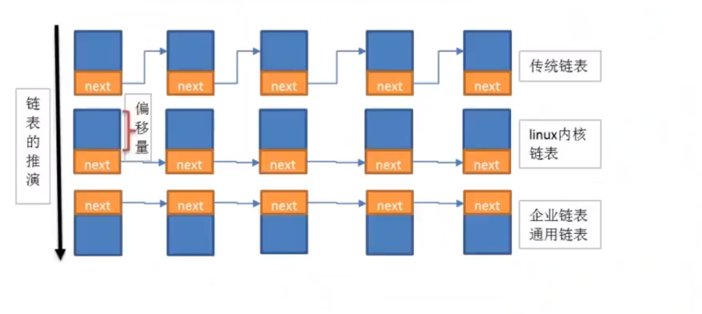
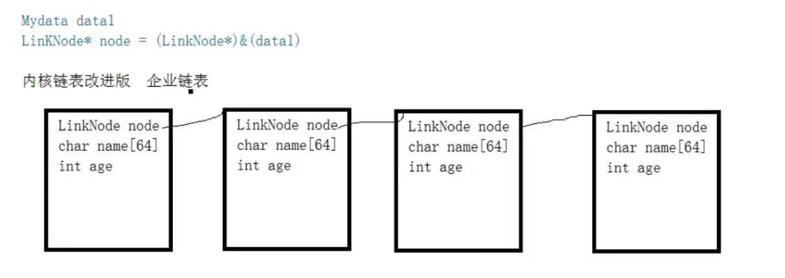

# 01 线性表

VSstudio 配置模板

https://blog.csdn.net/guchuanhang/article/details/70939682

O 表示法：

1.只关注最高次项

2.如果最高次项的乘数不是1， 就舍去

3.如果是常数，就是O(1)

插入新元素， 空间不足

申请更大的内存空间

旧的空间数据拷贝空间

旧的空间数据拷贝新空间

释放旧空间的内存

新元素插入到新空间

线性表的顺序存储： 用一块连续内存空间

线性表的链式存储： 不连续的内存空间, 

链表是由一系列的结点组成的， 链表在内存中是非连续的，每一个节点包含两个域，一个保存数据数据域，一个是保存节点关系的指针域。 

企业链表

