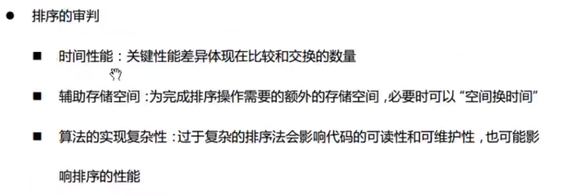

# Day 3 栈的应用和树

## 1.就近匹配原理图

## 2.中缀转后缀

## 3.后缀求解

## 4.树的存储结构

## 5.排序的基本概念

### (1)冒泡

### (2)选择

### (3)插入

### (4)希尔排序 (插入排序的升级版)

又叫增量排序

### (5)快速排序

目前最快的?

完全无序下, 快排的效率是最好的

分治法 + 挖坑填数

### (6) 堆排序

https://www.cnblogs.com/lanhaicode/p/10546257.html