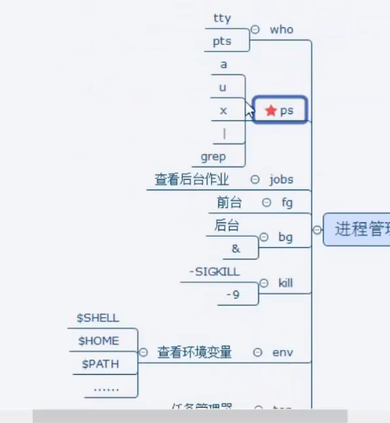

# 01 linux 简介

## 1.简介

什么是终端，一切输入输出设备的总称。

linux中teminal 是一个虚拟终端

shell 家族 

```shell
cat /etc/shells
```

查看当前系统支持的shell

```shell
echo $SHELL
```

当前使用的shell

常见shell

```
/bin/sh
/bin/bash
/usr/bin/bash
/bin/rbash
/usr/bin/rbash
/bin/dash
/usr/bin/dash
```


命令和路径补齐， 直接使用tab补齐

补齐出来的一定不会错


### 主键盘快捷建


ctrl + u 直接清除命令行


### 目录和文件

类unix的目录结构


linux 系统中 “所见皆文件”。

设备相关的都放在dev文件目录下

/etc/ passwd

/lib 所使用的库都在之中

usr 目录 安装的第三方库就在user下面

bin: 存放二进制可执行文件

boot：存放开机启动程序

dev：存放设备文件 :字符设备:鼠标 块设备:磁盘

home：存放用户

etc：用户信息和系统配置文件  passwd, group

lib:库文件  **libc.so.6 动态库,**只用头文件自动装载

root:管理员宿主目录(家目录)

user:用户资源管理目录


相对路径和绝对路径

cd -  两个路径的切换， 上一个跳转来的路径

cd .

cd /

cd 


ls -l 详细信息

ls -a 隐藏文件

ls -l 目录 会查看目录中的文件

ls -dl 会查看目录中本身

ls -R(l)  递归查看目录中及子目录的文件, 加rflic


Linux系统文件类型：

普通文件：-

目录文件：d

字符设备文件：c

块设备 文件：b

软链接：l （硬链接是普通文件)

管道文件： p

套接字：s

未知文件


which 指定命令所在路径

pwd 查看当前目录所在位置


mkdir 

rmdir 只能删除空目录, rm -r 递归删除, 这里-r 代表递归


cp hello.c hello.cpp


创建一个新目录

拷贝整个目录需要 cp -a  或 cp -r


cat 查看文件内容 

可以读终端, 


tac 倒着显示  (cat的反向);


more 分页显示 空格换页 回车换行 q 退出

less和more差不多,没有显示进度而已


head  显示文本的前十行  head -5 stdio.h 查看头5行,

tail - 5 查看后五行


tree 不是自带的 sudo apt-get install


du 显示目录大小

df 显示


软链接和硬链接

软链接: 为保证软链接可以任意搬移, 创建时务必对源文件使用绝对路径

ln -s 软链接, 生成的大小是路径的大小

创建路径根据 ln -s /home/itcast/28_Linux/file file2

这种使用绝对路径可以移动使用, 使用相对路径的软链接无法在其他路径下访问.

软链接的使用权限还是得参照原本的文件

硬链接:

ln file file.h

实现:我猜增加计数器,和指针 

 实际上使用的是Inode, 硬链接有相同的Inode. 实际上就是操作的同一个文件

删除只是Inode -1

当有相同inode的文件存在时,彼此同步.

删除时,只将硬链接数-1


### 文件属性和用户组

查看当前登录用户 whoami

chmod 修改文件属性

a, g, o,  u +- 权限

数字设定法:

chmod 471 文件名

创建新用户:

sudo adduser XXX

设置所有者:

sudo chown  XXX 待修改文件

创建用户组

sudo addgroup  新组名

修改文件所属用户组:

sudo chgrp 新用户组名 待修改文件

```
wong@kwong:~/Project/Interview_Summary/Linux/APUE/01_introduce$ sudo chown nobody:nogroup file
kwong@kwong:~/Project/Interview_Summary/Linux/APUE/01_introduce$ ls -l
总用量 16
-r--rwx--x 3 nobody nogroup   89 1月  20 09:46 file
-r--rwx--x 3 nobody nogroup   89 1月  20 09:46 file.h
-r--rwx--x 3 nobody nogroup   89 1月  20 09:46 file.hard
-rw-rw-r-- 1 kwong  kwong   3348 1月  20 10:07 introduce.md
```

sudo chown kwong:kwong file 还原组

删除用户

sudo deluser kwong2

删除用户组

sudo delgroup kwong2


使用 chown一次性修改所有者和组

sudo chown 所有者: 所有组 待操作文件


### 查找与检索

linux区分文件类型通过文件权限确定


find 以文件名查找

-type

find ~ -type 'l' //根据类型搜索  d/p/s/l/f/b/c

-name

find ~ -name '*.jpg'  // 按文件名搜索

-maxdepth

find 的 maxdepth参数必须为第一个参数 //

find ~ -size +20M -size -50M 按文件大小搜索 有上下限时,需要两个size参数 单位:k,M, G

ls -l -h 以人类可读的方式


-atime / amin

-ctime / cmin

-mtime / mmin


find ./ -maxdepth 1 -type f -exec ls -l {} \; 


find ./ -maxdepth 1 -type f -exec rm -r {} \;  

find ./ -maxdepth 1 -type f -ok rm -r {} \;  

exec 会自动询问有写保护的

-exec: 将find搜索的结果集执行某一指定命令.

  find ./ -name '*.cp' 

-ok: 以交互式的方式 将find的结果集执行某一指定命令

检索结果集.

find 的结果集不能改交给管道处理

find ./ -maxdepth 1 -type f | xargs ls -l

xargs 是linux内核在2.2后加入的新参数,  xargs 会做一个分片处理, 然后一片一片处理

xargs : 将find搜索的结果集执行某一指定命令. 当结果集过大,可以分片映射

 find ./ -maxdepth 1 -type f -print0 | xargs -print0 ls -l

```


 find ./ -maxdepth 1 -type f -print0 | xargs -print0 ls -l
xargs: 警告: 输入中有个 NUL 字符。它不能在参数列表中传送。您是想用 --null 选项吗？
ls -l ?...y
总用量 56
-rw-rw-r-- 1 kwong kwong     0 1月  20 11:23 'abc dsz'
-rw-r--r-- 1 kwong kwong 29950 1月  20 11:04  abc.h
-r--rwx--x 3 kwong kwong    89 1月  20 09:46  file
-r--rwx--x 3 kwong kwong    89 1月  20 09:46  file.h
-r--rwx--x 3 kwong kwong    89 1月  20 09:46  file.hard
lrwxrwxrwx 1 kwong kwong     4 1月  20 10:13  file.s -> file
drwxrwxr-x 2 kwong kwong  4096 1月  20 11:01  introduce.assets
-rw-rw-r-- 1 kwong kwong  5100 1月  20 11:12  introduce.md
```


grep

根据内容检索

 grep -r 'copy' ./  加上-r递归


ps 监视后台进程查看

单纯ps只显示可以和用户交互的


ps axf可以显示


ps aux | grep kwong

grep 搜索到的进程如果只有一条,说明没有包含检索信息的进程,那唯一一条是grep自己


### 安装卸载软件

apt-get

sudo apt-get install tree

知道软件名,命令

软件源:


软件安装:

1.联网

2.更新软件资源列表到本地 : sudo apt-get update

3.安装 sudo apt-get install 软件名

4.安装 sudo apt-get remove 软件名


red hat 和 debian系列

deb包安装

安装deb软件包命令: sudo dpkg -i xxx.deb

卸载 可以用apt-get 也可以使用 sudo dpkg -r xxx


源码包安装


### 磁盘管理

6.1 mount

6.2 unmount

6.3 dd


### 压缩包管理

1.tar - zcvf 要生成的压缩包名 压缩材料

​	tar zcvf test.tar.gz test1 dir2  (z代表gzip, c代表create ,f代表生成文件名, v代表不输出提示 ) 可以不强制使用.tar.gz

​	tar是用来打包的


tar jcvf test.tar.gz filr dir 使用bzip2 方式压缩	


解压: 将c 改为tar

tar zxvf test.tar.gz test1 dir2 

tar jxvf test.tar.gz filr dir 


2.gzip 只能压缩一个文件

3.bzip2  它也只能压缩一个文件,它也可以和tar结合使用


4.rar

rar a -r test.rar Music (最好带上.rar后缀) 压缩材料

unrar x test.rar

aptitude 可以替代apt-get 

sudo aptitude show unrar 查看某个库是否安装

sudo aptitude install unrar 使用apitude 安装


5.zip

zip -r testzip.zip dir stdio.h test2.mps

unzip testzip.zip

这个压缩格式可以和windows互通


进程管理:

who

jobs 操作系统查看用户后台


fg 前台

bg 后台 切换

kill 杀死命令

env 查看环境变量

top 文字版的任务管理器


更改密码

sudo passwd kwong2
新的 密码： 
重新输入新的 密码： 
passwd：已成功更新密码


root用户: 变成root用户

sudo su

# 网络管理

ifconfig

关闭网卡

sudo ifconfig eth0 down

开启网卡

sudp ifconfig eth0 up

给eth0 配置临时 IP

sudo ifconfig eth0 IP


### 其他命令

man 是一个帮助手册

man man

man 5 passwd


alias 起了别名 ls 就是系统给起了别名

alias pg='ps aux | grep' //不能有空格

ll 是 ls -laF

umask 指定用户的掩码, 不能指定处可执行的文件, x上

0002 第一个0 标识8进制


poweroff 

shutdown

reboot


需要安装的组件:

sudo apt-get install openssh-server

sudo apt-get install nfs-kernel-server

sudo apt-get install vsftpd

脑图


新建立的目录大小是4K 文件是0


touch 可以修改访问时间




