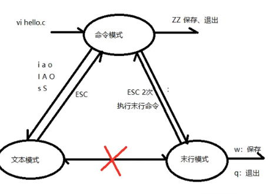
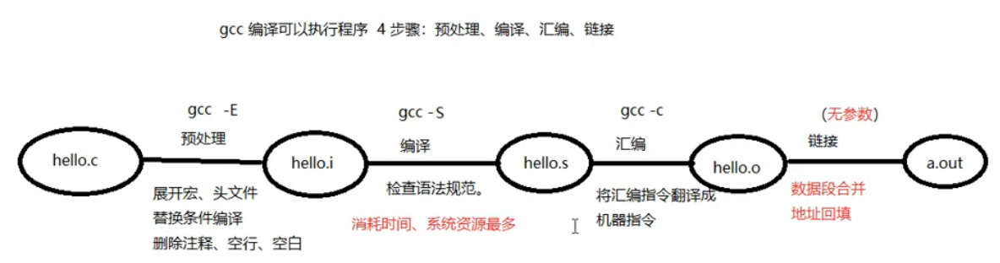

# 02 VIM GCC GDB

## 1.VI

vi有三种工作模式:

命令模式

​	vi hello.c 

文本模式

末行模式

hjkl : 左下上右

跳转到指定行:行号+ G 跳转页码

1. 88 G (命令模式)
2. :88 (末行模式)

跳转文件尾

 gg (命令模式)

G (命令模式)

gg=G(命令模式) 

括号跳转(命令模式) 

%

删除一个字母(命令模式) 

x

 删除一个单词 光标置于单词的首字母

dw

删除光标至行尾

D 或者 d+$

删除光标到行首

d0

将光标放置行首 :

0

把光标防止行尾 :

$

vi的撤回键 

u

替换键(命令模式)

r

删除指定区域:

按V转换为可视,hjkl来选中, 再使用

删除指定1行:

在光标所在行,按dd(命令模式)

删除指定n行:

在光标所在行, 按n+dd

复制一行: yy

粘贴一行:p(向后) P(向前)

查找和替换:

1.找设想内容:

 命令模式下, 按"/" 输入欲搜索关键字, 回车. 使用n检索下一个

2.找 看到的内容:

命令模式下,将光标置于单词的首部 按 '#' / '*' 一个向前 一个向后

3.单行替换:

将光标置于待替换行上, 进入末行模式, 输入 :s /源数据/替换数据

4.通篇替换

:%s /源数据/替换数据g  g:不加, 只替换每行的首个

5.指定行的替换:

末行模式

: 起始行号,终止行号s /printf/println/g

撤销, 反撤销:

r ctrl+r

vim:分屏 :sp 横屏分

竖屏分:vsp

ctrl + ww 切换屏幕

跳转至man page

NK 或 K

跳转至宏定义 [d

在末行模式执行shell命令:

 :!cammand  例如 :!ls -l

将 vim 配置成 IDE

/etc/vim/vimrc

~/.vimrc

~/.vimrc 优先级高

## GCC 编译可执行程序 4步骤

5步骤: 预处理, 编译, 汇编, 链接

gcc -I ./inc hello.c -o hello

-I 包含头文件的路径

-o 只是输出的文件名称

-c: 只做,预处理,编译,汇编, 得到二进制文件

-g: 编译时添加调试文件.  加上的程序才可以调试 (gdb)

-On n = 0~3 编译优化, n越大优化得越多

-Wall 提示更多警告信息 警告分级

-D  <DEF> 编译时定义宏 (可以用一个宏做一个开关, 打开宏,调试信息全开, 关闭宏, 调试信息全关)

-E 生成预处理文件

gdb: 

file hello 2

b n 设置breakpoint

