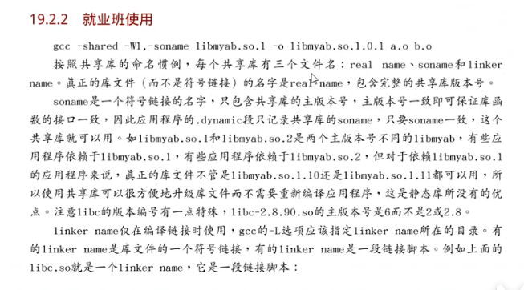
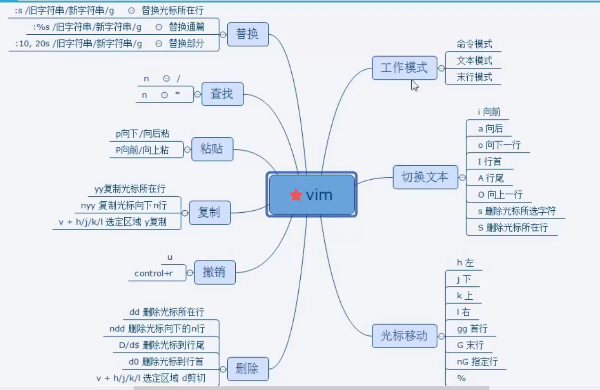

# 02 VIM GCC GDB

## 1.VI

vi有三种工作模式:

命令模式

​	vi hello.c 

文本模式

末行模式

hjkl : 左下上右

跳转到指定行:行号+ G 跳转页码

1. 88 G (命令模式)
2. :88 (末行模式)

跳转文件尾

 gg (命令模式)

G (命令模式)

gg=G(命令模式) 

括号跳转(命令模式) 

%

删除一个字母(命令模式) 

x

 删除一个单词 光标置于单词的首字母

dw

删除光标至行尾

D 或者 d+$

删除光标到行首

d0

将光标放置行首 :

0

把光标防止行尾 :

$

vi的撤回键 

u

替换键(命令模式)

r

删除指定区域:

按V转换为可视,hjkl来选中, 再使用

删除指定1行:

在光标所在行,按dd(命令模式)

删除指定n行:

在光标所在行, 按n+dd

复制一行: yy

粘贴一行:p(向后) P(向前)

查找和替换:

1.找设想内容:

 命令模式下, 按"/" 输入欲搜索关键字, 回车. 使用n检索下一个

2.找 看到的内容:

命令模式下,将光标置于单词的首部 按 '#' / '*' 一个向前 一个向后

3.单行替换:

将光标置于待替换行上, 进入末行模式, 输入 :s /源数据/替换数据

4.通篇替换

:%s /源数据/替换数据g  g:不加, 只替换每行的首个

5.指定行的替换:

末行模式

: 起始行号,终止行号s /printf/println/g

撤销, 反撤销:

ur ctrl+r

vim:分屏 :sp 横屏分

竖屏分:vsp

ctrl + ww 切换屏幕

跳转至man page

NK 或 K

跳转至宏定义 [d

在末行模式执行shell命令:

 :!cammand  例如 :!ls -l

将 vim 配置成 IDE

/etc/vim/vimrc

~/.vimrc

~/.vimrc 优先级高

https://blog.csdn.net/engineerhe/article/details/103889347

## GCC 编译可执行程序 4步骤

5步骤: 预处理, 编译, 汇编, 链接

gcc -I ./inc hello.c -o hello

-I 包含头文件的路径

-o 只是输出的文件名称(重命名)

-c: 只做,预处理,编译,汇编, 得到二进制文件

-g: 编译时添加调试文件.  加上的程序才可以调试 (gdb)

-On n = 0~3 编译优化, n越大优化得越多

-Wall 提示更多警告信息 警告分级

-D  <DEF> 编译时定义宏 (可以用一个宏做一个开关, 打开宏,调试信息全开, 关闭宏, 调试信息全关)

-E 生成预处理文件

-l 指定库名

-L 指定库路径

gdb: 

file hello 2

b n 设置breakpoint

## 静态库

库的好处可以提高编译的效率, 也可以减少重复代码.

静态库:库是固定的, 共享库又叫动态库.

静态库给每个使用的程序 都加载到内存中, 这样内存消耗很高

多个应用程序共享这个库

静态库直接将库文件复制到自己的内存区, 调用速度快, 动态库调用速度慢一些.

静态库: 对空间要求较低,而对时间要求就高的核心程序中.(使用较少`) 

动态库: 对时间要求较低,对空间要求较高的.

创建静态库,或要将目标代码加入到已经存在的静态库中,可以使用以下命令:

ar rcs libmylib.a file1.o

静态库以lib开头,以.a结尾. 后面是源文件

静态库制作步骤:

1.将.c 生成.o 文件

 		gcc -c add.c -o add.o

2.使用ar 工具制作静态库

​	ar rcs lib库名.a  add.o ...... 

​	collect2: 链接器,在链接中出错

collect2: error: ld returned 1 exit status

-rwxrwxr-x 1 kwong kwong 16872 1月  21 11:15 test*
-rwxrwxr-x 1 kwong kwong 16872 1月  21 11:17 test1*

3.编译静态库到可执行文件中:

​	gcc test.c libmymath.a -o test1

implict 隐性的

gcc test.c ./lib/libmymath.a -o a.out -I ./inc

做了lib静态库,还需要写inc头文件库.

头文件守卫:防止头文件被重复包含

​	#ifndef _HEAD_H\_

​	#definr _HEAD_H\_

​	......

​	#endif

动态库制作及使用:

​	1.将.c生成.o 文件, (生成与位置无关的代码 -fPIC)

​		gcc -c add.c -o add.o -fPICe

2.使用gcc -shared 制作动态库

 	gcc -shared lib库名.so add.o sub.o div.o

3.使用动态库编译可执行程序时,指定所使用的动态库. -l : 指定库名 -L:指定库路径.

​	gcc test.c -o a.out -lmymath -L ./lib

4.运行可以执行程序 ./a.out  出错!!!

原因:

链接器: 工作与链接阶段, 在a.out生成前 工作需要 -l 和 -L

动态链接器: 工作于程序运行阶段, 工作室需要提供动态库目录位置.  

export LD_LIBRARY_PATH=./lib 

export到处环境变量新值, 

以上是临时生效,永久生效需要写入终端配置文件 .bashrc

1.vi ~/.bashrc

2.写入 export LD_LIBRARY_PATH = 动态链接库 保存

3..      . .bashrc/ source .bashrc / 重启 终端 --->让修改后的 .bashrc生效

4../a.out 成功

还有一种方法是 拷贝自定义的动态库到 /lib (标准C库所在的目录位置)

配置文件法:

sudo vim /etc/ld.so.conf

在上述文件中添加动态库所在的绝对路径

sudo ldconfig -v

ldd a.out

调用到动态库的时候才会绑定动态库

​	

​	普通函数链接(右侧红字)

​	动态库,延迟绑定

​	./a.out: error while loading shared libraries: libmymath.so: cannot open shared object file: No such file or directory

ldd ./a.out 查看会加载哪些动态库的路径

数据段合并: .bss 和 .data 合并 .rodata 和 .text 合并 因为可以减少空间, 让它们合并到一页中去

