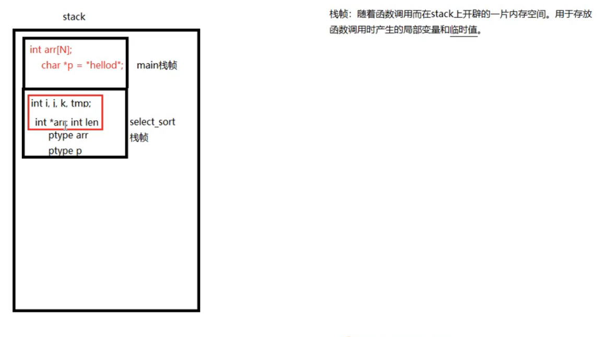

# APUE 03 GDB MAKEFILE

## 1.GDB

gdb调试工具: 大前提:程序是你自己写的. --逻辑错误

gcc -g main.c -o main 

必须增加-g 相当于增加了调试表

常用命令

 -g : 使用该参数编译可执行文件, 得到调试表

gdb a.out

list:  list(l) 1列出源码. 根据源码指定 行号 设置断点.

b : b 20 在20 行设置断点

run/r : 运行程序

n/next : 下一条指令 (会越过函数)

s/step: 下一条指令(会进入函数)

p/print: p i 查看变量的值.

until n : 执行到第多少行

continue: 继续执行断点后续指令.

quit: 退出gdb 当前调试.

start: 从第一行开始执行

finish: 结束当前函数调用

run 字符串1 字符串2 ...: 设置main函数命令行参数

set args: 设置mian函数命令行参数

info b : 查看断点信息表

b 20 if i = 5: 设置条件断点

ptype : 查看变量类型

backtrace/bt: 列出当前程序正存活着的栈帧.

frame: 根据栈帧编号, 切换栈帧

display: 设置跟踪变量. 使用变量的编号.

undisplay: 取消设置跟踪变量. 使用跟踪变量的编号.

delete/d : 删除断点 d breakpoints NUM

file 读符号表

其他用法:

​	使用run 查找段错误出现位置

​	

函数调用完后,栈帧会消失

## 2.Makefile 项目管理文件

命名: makefile / Makefile	 --make命令

1个规则:

​		目标:依赖条件

​			(一个tab缩进) 命令

​		1.目标的事件必须晚于依赖条件的事件,否则更新.

​		2.依赖条件不存在,找寻新的规则去产生依赖.

​		3.ALL:指定makefile的终极目标.

​	2个函数以及clean: ($ 代表取值)

​		src = $(wildcard ./*.c): 匹配当前工作目录下的所有.c文件. 将文件名组成列表, 赋值给变量src. 

​		obj = $(patsubst %.c %.o, \$(src)): 将参数3中,包含参数1 的部分,替换为参数2

​		make clean -n 模拟执行,防止删除错误

​		clean: (没有依赖)

 			-rm -rf $(obj)  a.out "-" 作用是,删除不存在文件时, 不报错.顺序执行结束

​	3个自动变量:

​			$@: 在规则的命令中,表示规则中的目标

​			$<: 标识规则中的命令中, 标识第一个条件

​			$^: 标识规则中的命令中, 表示规则中的所有条件,组成一个列表,以空格隔开,如果这个列表中有重复的项则消除重复项.

​	模式规则: 

​			%.o:%.c

​					gcc -c $< -o %@

​			

​	静态模式规则:

​			$(obj):%.o: %.c 

​	伪目标:

​			.PHONY: clean ALL

​	参数:

​		-n:模拟执行make, make clean 命令

​		-f 指定文件执行make命令.      xxxx.mk cd

