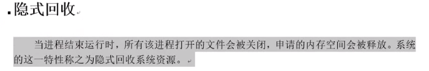
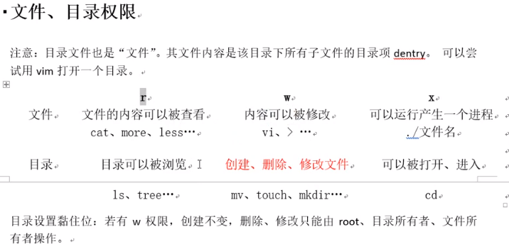

# 04_FIFO

# 系统编程阶段说在前面的话

系统调用  内核提供的函数
库调用 程序库中的函数

open 函数

manpage 第二卷,open 函数如下,有两个版本的

返回一个文件描述符,理解为整数,出错返回-1

pathname 文件路径

flags 权限控制,只读,只写,读写。  O_RDONLY, O_WRONLY, O_RDWR

第二个 open

多了一个 mode 参数,用来指定文件的权限,数字设定法

文件权限 = mode & ~umask

open 常见错误:

1.打开文件不存在

2.以写方式打开只读文件(权限问题)

3.以只写方式打开目录

4.当 open 出错时,程序会自动设置 errno,可以通过 strerror(errno)来查看报错数字的含义
以打开不存在文件为例:

执行该代码,结果如下:

open 函数:

int open(char *pathname, int flags)  #include <unistd.h>

参数:

​	pathname: 欲打开的文件路径名

​	flags:文件打开方式:  #include <fcntl.h>

O_RDONLY|O_WRONLY|O_RDWR O_CREAT|O_APPEND|O_TRUNC|O_EXCL|O_NONBLOCK

返回值:

​	成功: 打开文件所得到对应的 文件描述符(整数)

​	失败: -1, 设置 errno

int open(char *pathname, int flags, mode_t mode) 123 775

参数:
pathname: 欲打开的文件路径名

flags:文件打开方式:O_RDONLY|O_WRONLY|O_RDWR
O_CREAT|O_APPEND|O_TRUNC|O_EXCL|O_NONBLOCK ....

mode: 参数 3 使用的前提, 参 2 指定了 O_CREAT。 取值 8 进制数,用来描述文件的 访问权限。 rwx 0664
创建文件最终权限 = mode & ~umask
返回值:
成功: 打开文件所得到对应的 文件描述符(整数)
失败: -1, 设置 errno

close 函数:

int close(int fd);

open函数:

​	int open(char *pathname, int flags)

​		pathname: 与大开得文件路径名

​	flags:文件打开方式:   O_RDONLY| O_WRONLY|O_RDWR     O_CREAT|O_PPEND|O_TRUNC|O_EXCL|O_NONBLOCK....

​	EXCL:是否存在

返回值:

​	成功: 打开文件所得到对应的 文件描述符(整数)

​	失败:-1, 设置errno

open函数:

​	int open(char *pathname, int flags. mode_t mode)

​		pathname: 与大开得文件路径名

​	flags:文件打开方式:   O_RDONLY| O_WRONLY|O_RDWR     O_CREAT|O_PPEND|O_TRUNC|O_EXCL|O_NONBLOCK....

​	mode: 参3使用的前提,参2指定了O_CREAT. 取值8进制数, 用来描述文件的访问权限. rwx 0664

​	创建文件最终权限 = mode&~umask

​	EXCL:是否存在

返回值:

​	成功: 打开文件所得到对应的 文件描述符(整数)

​	失败:-1, 设置errno

close函数:

​	int close(int fd);

错误处理函数:   与errno相关

​	printf("xxx error: %d\n," , errno);

​	char* strerror(int errnum);

​		printf('xxx error: %s\\n', strerror(errorno));

void perror(const char* s);

​		perror("failed xxx");

read函数:

​	ssize_t read(int fd, void* buf, size_t count)

​	参数:

​			fd: 文件描述符

​			buf: 存数据的缓冲区

​			count: 缓冲区的大小

​	返回值:

​			成功: 读到的字节数.

​			失败: -1, 设置errno

​			若errno = EGAIN 或 EWOULDBLOCK, 说明不是read失败, 而是read在读一个设备文件(网络文件), 并且文件无数据.

write函数:

​	ssize_t write(int fd, const void* buf, size_t count)

​	参数:

​			fd: 文件描述符

​			buf: 待写出数据的缓冲区

​			count:  数据大小

​	返回值:

​			成功: 写入的字节数.

​				0:表示读到文件末尾

​			失败: -1, 设置errno

​			

strace 跟踪系统调用

strace ./read_cmp_getc

strace ./getc_cmp_read

调用库函数的过程:

可以观察系统调用的过程 

图:预读入,缓输出操作

从用户空间进入内核消耗的时间代价大.

fputc中内部有一个缓冲(蓝方框) 默认4096, 再调用write或read

read \ write 函数常常被称为Unbuffered I/O. 指的是无用户级缓冲,但不保证内核缓冲区.

有时侯也不希望有保留的缓冲区

PCB控制块的本质是一个结构体

 文件描述符虽然是整数,但本质是指针, 是键值对映射,为什么我赶紧是一个数组的索引.

数组索引拿到指针,再通过指针找到文件.

一个进程默认打开的文件个数 最多能打开1024个文件

ulimit -a

通过 ulimit -n  4096可以修改

文件描述符:

句柄:可以看作一个门把手(指针)

​	PCB 进程控制块: 本质 结构体.

​	成员:文件描述符.

​	文件描述符: 0/1/2/3/4 ....../1023 表中可用的最小的.

​	  

# 阻塞, 非阻塞 是设置在文件,网络文件的属性

产生阻塞的场景:读设备文件, 读网络文件. 读常规文件是不会阻塞的.

/dev/tty -- 终端文件

open("/dev/tty", O_RDWR | O_NONBLOCK) ---- 设置 /dev/tty 非阻塞状态. (默认为阻塞状态)

fcntl:

​	获取文件状态: F_GETFL

​	设置文件状态: F_SETFL

lseek 函数 (lseek.c)

​	off_t lseek(int fd, off_t offset, int whence);	

​	参数:

​				fd:文件描述符

​				offset: 偏移量

​				whence:起始偏移位置: SEEK_SET/SEEK_CUR/SEEK_END

​	返回值:

​				成功: 较起始位置偏移量

​				失败: -1 errno

​	应用场景:

​			1.文件的"读", "写" 使用同一偏移位置(可以将其返回到起始位置)

​			2.使用lseek获取, 扩展文件大小

​			3.使用lseek扩展文件大小:要想文件大小真正扩展, 必须引起IO操作 

​	产生的文件空洞

​		od -tcd lseek_test.c   //十进制

​		od -tcx lseek_test.c  //十六进制 

使用trancate直接扩展文件

​	int truncate(const char *path, off_t length);

传入参数: 

​		1.指针作为函数参数.

​		2.通常有const关键字修饰

​		3.指针指向有效区域,在函数内部做读操作

传出参数:

​		1.指针作为函数参数.

​		2.在函数调用之前,指针指向的空间可以无意义,但必须有效

​		3.在函数内部做写操作 

​		4.函数调用结束后,充当函数返回值

传入传出参数: (例如 stroke_r) 

​		1.指针作为函数参数

​		2.在函数调用之前,指针指向的空间有实际意义

​		3.在函数内部,先做读操作, 后做写操作

​		4.函数调用结束后,**充当**函数返回值.

void aaa(int \*p, int\* p2, int\* p3);

bbb(){

aaa(); 

}

 文件存储:

​	inode:其本质为结构体, 存储文件的属性信息. 如:

格式化后还学要弄一些文件将其覆盖才真正擦除

stat函数:

​	int stat(const char *pathname, struct stat *statbuf);

​	参数:

​			path: 文件路径

​			buf: (传出参数)存放文件属性 (struct stat)

​		返回:

 			成功:0

​			失败: -1 errno

​	获取文件大小: buf.st_size

​	获取文件类型: buf.st_mode

​	获取文件权限: buf.st_mode 

lstat函数:

​	穿透符号链接: stat:会 ；lstat: 不会;

​	

st_mode的位图分布

readlink 读符号链接本身.

rename()

目录操作函数:

​			DIR* opendir(char* name);

​			int closedir(DIR* dp);

​			struct dirent* readdir(DIR* dp);

​			struct dirent {

​			inode;

​			char dname[256]; 			

​		}

stat函数

./a.out /home/itcast /home/ticast/28_linux ./abc/ 

实现递归遍历目录:  ls -R.c

1.判断命令行参数, 获取用户要查询的目录名  argv[]

​		argc == 1-->./

2.判断用户指定的是否是目录 stat S_ISDIR();

3.读目录:

​	opendir()

​	while(readdir()){

​		普通文件直接打印

​		目录:

​				拼接目录访问绝对路径. sprintf(path, "%s/%s", dir, d_name); dir/d_name

​				递归调用自己.  -----> opendir readdir closedir

}

​	closedir();

}

fetchdir ---> isfile ----> fetchdir

重定向: (duplicate 重定向)

int dup(int oldfd);

​	oldfd: 已有文件描述符

​	

dup2	(dup to  )

fcntl函数实现dup:

​		Int fcntl(int fd, cmd, .....);

​		cmd: F_DUPFD

​		参3: 被占用的, 返回最小可用的.

​			未被占用的, 返回-该值的文件描述符号

有多个指向的文件.

