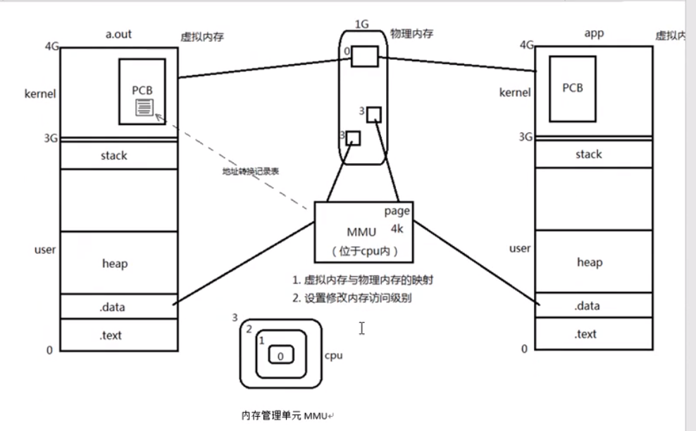

# 05_PROCESS

进程:

​	程序:死的. 只占用磁盘空间.				---------剧本

​	进程:活得, 运行起来的程序. 占用内存, cpu等系统资源  -------戏

​	

寄存器大小是4字节;

 

PCB进程控制块:

​	进程id

​	文件描述符表

​	进程状态: 就绪态, 运行态,挂起态, 终止

​	进程工作目录位置

​	umask掩码

​	信号相关信息资源

​	

