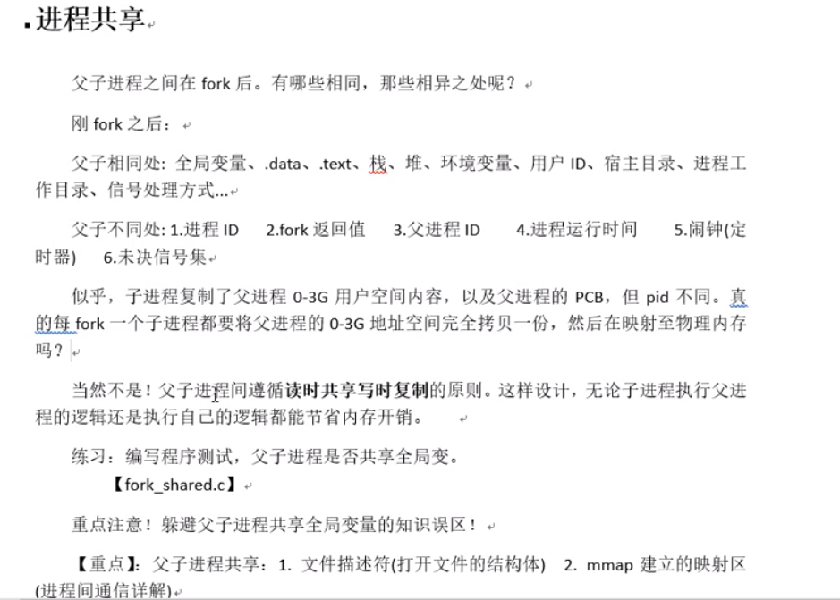
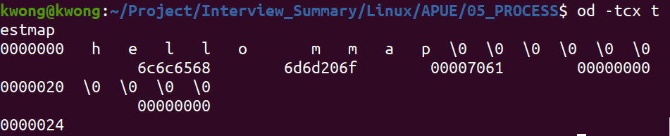

# 05_PROCESS

进程:

​	程序:死的. 只占用磁盘空间.				---------剧本

​	进程:活得, 运行起来的程序. 占用内存, cpu等系统资源  -------戏

​	


寄存器大小是4字节;


 


PCB进程控制块:

​	进程id

​	文件描述符表

​	进程状态: 就绪态, 运行态,挂起态, 终止

​	进程工作目录位置

​	umask掩码

​	信号相关信息资源

​	用户id和组id

​	环境变量:

```shell
kwong@kwong:~$ echo $SHELL
/bin/bash
kwong@kwong:~$ echo $PATH
/usr/local/sbin:/usr/local/bin:/usr/sbin:/usr/bin:/sbin:/bin:/usr/games:/usr/local/games:/snap/bin
kwong@kwong:~$ echo $TERM
xterm-256color
kwong@kwong:~$ echo $LANG
zh_CN.UTF-8
kwong@kwong:~$ echo $LANG
zh_CN.UTF-8
env #直接查看所有环境变量
```

 





fork函数:

​	pid_t fork(void)

​	创建子进程. 父子进程各自返回. 父进程返回子进程pid. 子进程返回0.

​	getpid();

​	getpid();

​	循环创建N个子进程模型. 每个子进程标识自己的身份.

父子进程相同

​	刚fork后. data段. text段, 堆, 栈 , 环境变量,全局变量,宿主目录位置, 进程工作目录位置, 信号处理方式


父子进程不同: 

​	进程id, 返回值, 各自的父进程,进程创建时间, 时钟,未决信号集

父子进程共享:

​	读时共享,写时复制

​	1.文件描述符 2. mmap映射区


.


exec函数族:

 


主要记住前两个函数

加载一个进程, 通过路径+程序名 来加载.

gdb调试:

​		设置父进程调试路径: set follow-fork-mode parent (默认跟踪父进程)

​		设置子进程调试路径: set follow-fork-mode child

exec函数族:

​		使进程执行某一程序. 成功**无返回值,** 失败返回 -1

​		int execlp(const char* file, const char* arg, .....):     借助path环境变量寻找执行程序

​				参1:程序名

​				参2: argv0

​				参3: argv1

​				参4N: argvN

​				哨兵: NULL

​		int execl(const char* path, const char* arg, .....)   自己指定待执行程序路径

​		int execvp();


孤儿进程: 父进程先于子进程结束, 则子进程称为孤儿进程, 子进程的父进程成为init进程, 称为init进程领养孤儿进程. [orphan.c ]   有可能不是系统级的init收养,有可能是用户级的init进程.

ps : axj, axf(我觉得这个好用)


僵尸进程:

 僵尸进程:进程终止, 父进程尚未回收,子进程残留资源PCB存放于内核中,变成僵尸进程.

特别注意,**僵尸进程是不能使用kill命令清除掉**的. 因为kill命令只是用来终止进程的, 而僵尸进程已经终止. 思考! 用什么办法可清除僵尸进程呢?[zoom.c]


wait 函数 : 回收子进程退出资源 (见zoom_test)

 pid_t wait(int *wstatus);

​	参数: (传出) 回收进程的状态.

​	返回值: 成功: 返回回收进程的pid

​	失败: -1 , errno

​	函数作用1:  	阻塞等待子进程退出

​	函数作用2:  	清理子进程残留在内核的pcb资源

​	函数作用3: 	 清理传出参数, 得到子进程结束状态

​	获取子进程正常终止值:

​			WIFEXITED(status)  ---->为真 ----> 调用 WEXITSTATUS(status) -->得到子进程退出值

​			WIFSIGNALED(status) ---->为真 ---->调用 WTERMSIG(status) --->导致子进程异样终止的信号编号.

​            


返回值的用法


waitpid函数:    指定某一个进程进行回收, 可以设置非阻塞

​		pid_t waitpid(pid_t pid, int *wstatus, int options);	

​		参数: 

​				pid:  > 0 指定回收的子进程pid

​							-1 回收任意子进程(相当于wait)

​							0 回收和当前调用waitpid一个组的所有子进程]

​							< -1 回收指定进程组内的任意子进程


​				status: (传出)回收进程的状态 

​				options: WNOHANG代表没回收就跑(指定回收方式为**非阻塞)**

​		返回值: >0 :表成功回收的子进程pid

​						0: 函数调用时, 参3指定了WNOHANG, 并且,没有子进程结束.

​						-1:失败.

​		

总结:

​		wait, waitpid: 一次调用,  回收一个子进程.

​					想回收多个: while (我觉得for也可以,指定个数)


进程间通信的常用方式, 特征:

 			管道: 简单

​			信号: 开销小

​			mmap映射: 非血缘关系进程间通信

​			socket(本地套接字): 稳定


管道


​		4.只能在有公共祖先的进程间使用管道


常见的通信方式:单工通信,全双工通信.


管道:

​		实现原理: 内核借助环形队列机制, 使用内核缓冲区实现.

​		特质: 1. 伪文件

2.管道中的数据只能一次读取

3.数据在管道中,只能单向流动

局限性:1.自己写,不能自己读

​			2.数据不可以反复读

​			3半双工通信

​			4.血缘关系进程间可用

pipe函数:    创建并打开管道, 用于有血缘关系的进程间通信. ps aux | grep   ....  ls | wc -l | grep xx | sdfaf | sdfadf

​			int pipe(int fd[2]);

​			参数: fd[0]:读端

​					fd[1]: 写端

​			返回值: 成功:0

​							失败;-1

管道的读写行为:(缓冲区4096, 可能自动扩容,和linux有关)

​		读管道:

​			1.管道有数据: read 返回实际读到的字节数.

​			2.管道无数据:

​					 1) 无写端, read 返回0 (类似文件尾)

​						2)有写端, read阻塞等待

​		写管道:

​					1)无读端, 异常终止(由于SIGPIPE,读端关闭了还往里面写, 被操作系统怀疑是病毒)

​					2) 有读端:  

​							1)管道已满: 阻塞等待

​							2)管道未满,返回写出的字节个数

​			


图:刚创建完的管道


父进程关闭读端,子进程关闭写端


ls | wc -l

**ls:**dup2(fd[1], stdout);

**wc -l**  dup2(fd[0,1], stdin);


伪文件: 管道,套接字, 字符设备, 块设备 都是不占磁盘空间的


兄弟进程间通信  (pipe_broth.c)  


是否允许,一个pipe有多一个写端,多个读端?  允许


是否允许有一个读端多个写端?允许 


栈空间比较小, 堆空间比较大. heap堆比较大

​       long fpathconf(int fd, int name);  //查看pipe大小


FIFO(命名管道)解决没有关系的进程间通信

int mkfifo(const char *pathname, mode_t mode);

fifo 管道: 

​		命名管道: mkfifo

​		无血缘关系进程间通信

​				读端: open file O_RDONLY

​				写端: open file O_WRONLY


可以多可写端,多个读端(fifo_r.c fifo_w.c)

可以多可读端,多个写端(fifo_r.c fifo_w.c)

管道间读会阻塞


普通文件进程间通信(fork_share_fd.c)

不同的进程之间可以共享文件(没有血缘关系: test1.c test2.c)

  打开的文件是内核中的一块缓冲区. 多个无血缘关系的进程, 可以同时访问该文件.

读不到不会阻塞(而匿名管道在读写两端兼具的时候会阻塞)


共享内存映射**(进程间通信最快的)**

存储映射I/O


 void *mmap(void *addr, size_t length, int prot, int flags,int fd, off_t offset);

参数: 

​			addr: 指定映射区的首地址. 通常传NULL, 表示让系统自动分配.

​			length: 共享映射区的大小( <= 文件的实际大小)

​			prot:共享内存映射区的读写属性. PROT_READ, PROT_WRITE,  PROT_READ|PROT_WRITE

​			flags: 标注共享内存的共享属性. MAP_SHARED, MAP_PRIVATE

​			fd: 用于创建共享内存映射区的那个文件的文件描述符

​			offset: 默认0, 映射文件全部. 偏移位置. 必须是4k的整数倍.

返回值:

​		成功: 映射区的首地址

​		失败: MAPFAILED:(void*) (-1)            errno

使用注意事项:

  1.用于创建映射区的大小为0, 实际指定非0大小创建映射区, 出总线错误.

 2.用于创建映射区的 文件大小为0, 实际指定0大小创建映射区, 出"无效参数".

3.用于创建映射区的文件读写属性为:**只读.** 必须要有, 映射区属性为 读, 写. 出"无效参数"

4.创建映射区需要, read权限. 当访问权限指定为"共享"MAP_SHARED是,  mmap的读写权限,应该<=文件的open权限. 只写不行

5.文件描述符fd, 在mmap创建映射区即可关闭,后续访问文件,用地址访问.

6.offset 必须是 4096的整数倍. (MMU 映射的最小单位 4k)

7.对mmap越界怎么样: 对申请的内存, 不能越界访问. 和malloc类似

8.不能对mmap返回的指针进行++操作, 因为会影响munmap释放内存. munnap释放的地址必须是mmap返回的

9.映射区访问权限为"私有" MAP_PRIVATE, 对内存所做的修改,只在内存有效, 不会反映在物理磁盘上.

10.映射区访问权限为"私有" MAP_PRIVATE , 只需要open文件时, 有读权限, 用于创建映射区即可


总结

使用mmap时务必注意以下事项:

1.创建映射区的过程中，隐含着一次对映射文件的读操作。

2.当MAP_SHARED时，要求：映射区的权限应该<=文件打开的权限（出于对映射区的保护）。而MAP_PRIVATE则无所谓，因为mmap中的权限是对内存的限制。

3.映射区的释放与文件关闭无关。只要映射建立成功，文件可以立即关闭。

4.特别注意，当映射文件大小为0时，不能创建映射区。所以：用于映射的文件必须有实际大小！！mmap使用时常常会出现总线错误(指定大小非零)，通常是由于共享存储空间大小引起的。如,400字节大小的文件, 在建立映射区时offset4096字节,则会报出总线错误.

5.munmap传入的地址一定是mmap的返回地址。坚决杜绝指针++操作。不能给unmap释放

6.如果文件偏移量必须为4k的整数倍。

7.mmap创建映射区出错概率非常高，一定要检查返回值，确保映射区建立成功再进行后续操作。


mmap函数的保险调用方式:

1.open(O_RDWR)

2.mmap(NULL,有效文件大小, PROT_READ|PROT_WRITE, MAP_SHARED, fd, 0);


int munmap(void* addr, size_t length);  释放映射区

​		addr: mmap的返回值





 总线错误


参数错误


mmap父子进程间通信

	


设置为私有时


父子进程使用mmap进程键通信

父进程 先 创建映射区 open(O_RDWR) mmap();

指定MAP_SHARED(不能用MAP_PRIVATE)  权限

一个进程读, 另一个进程写.


mmap无血缘关系进程间通信(mmap_r.c / mmap_w.c)

两个进程 打开同一个文件, 创建映射区

​	指定flags 为 MAP_SHARED.

​	一个进程写入, 另一个进程写出.

​	[注意] : 无血缘关系进程间通信.  mmap: 数据可以重复读取.

​															fifo : 数据只能读取一次  


匿名映射: 父子间通信更方便,  非血缘的进程之间可以通信.

​		可以随意指定输出大小. MAP_ANON是Linux的方言.

​		int fd = open("/dev/zero", );


复习思维导图


信号一般不携带数据, 标志一个状态的变化

共享内存速度最快


]


