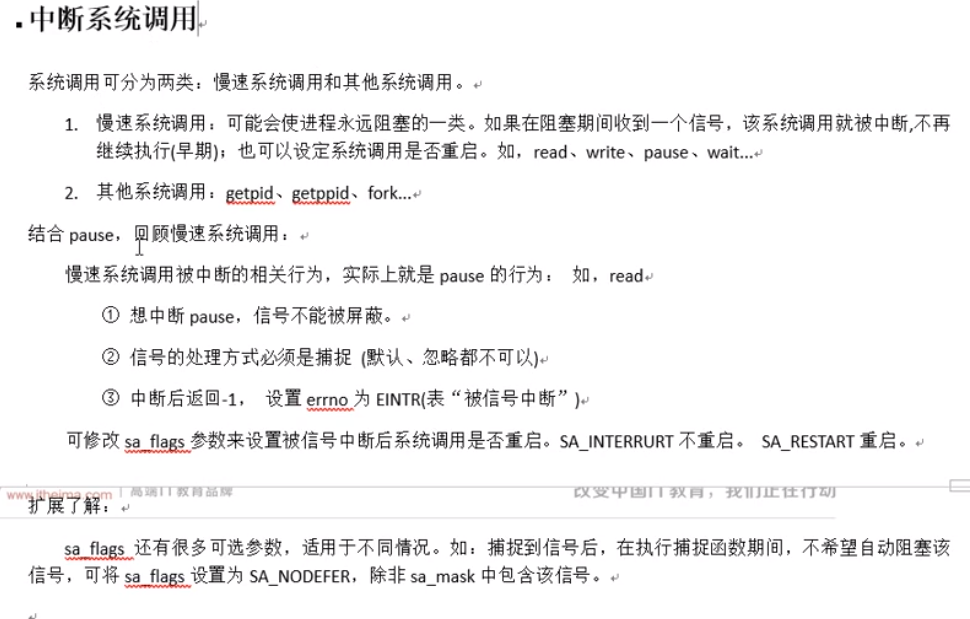

# 06  APUE 信号


信号共享:

​			简单, 不能携带大量信息, 满足条件才发送.

信号的特质:

​			信号是软件层面上的"终端". 一旦信号产生, 无论程序执行到什么位置,必须立即停止运行,处理信号,处理结束,再继续执行后续命令

​			所有信号的产生及处理都是由[内核]完成的


段错误: 非法访问内存: 对只读区域写错做, 访问越界栈溢出等


信号相关的概念:

​			产生信号:

​						1.按键产生

​						2.系统调用产生

​						3.软件条件产生alarm

​						4.硬件异常产生 端错误等

​						5.命令产生  kill

​			概念:	

​						未决: 产生与递打之间的状态

​						递打:产生并且送达的进程. 直接被内核处理掉

​						信号处理方式: 执行默认处理动作, 忽略, 捕捉(自定义)

​						阻塞信号集(信号屏蔽字) : 本质: 位图. 用来记录信号的屏蔽状态. 一旦被屏蔽的信号,在解除屏蔽前, 一直处于未决状态. 

​						未决信号集:本质:位图. 用来记录信号的处理状态.该信号集中的信号,表示已经产生,但尚未处理


图: (表间man 7 )

信号四要素:

​		信号使用前, 应先确定其4要素, 而后再用!!!

​		信号编号,事件名称, 信号对应事件 , 信号默认的处理动作


kill -9 -10698 指杀死进程组中的进程

​       int kill(pid_t pid, int sig);

当pid = -1 时 非常危险

以下代码非常危险, 不要轻易尝试


kill命令和kill函数:

​		int kill(pid_t pid, int sig);

​					pid:  >0 杀指定进程

​							=0 杀跟调用kill函数的那个进程处于同一进程组的进程

​							<-1: 取绝对值, 杀死绝对值所对应的进程组的所有组员

​							= -1 发送信号给, 有权限发送的所有进程.

​					返回值: 成功 0

​									失败 -1

其他几个发送信号函数:

​				raise();

​				abort();


alarm函数:  使用自然计时法

​			定时发送SIGALARM 给当前进程

unsigned int alarm(unsigned int seconds);

​				seconds: 定时描述

​				返回值: 上次定时剩余时间. 无错误现象

​				alarm(0)；取消闹钟

time命令: 查看程序执行时间. 实际时间	 = 系统时间 + 用户时间 + 等待时间	 --->优化瓶颈IO	


      int setitimer(int which, const struct itimerval *new_value,
                     struct itimerval *old_value);
setitimer:  精度定时, 周期定时

which: ITIMER_REAL: 采用自然计时  ----> SIGALRM

ITIMER_VIRTUAL: 采用用户空间计时 ------> SIGVTALRM

ITIMER_PROF : 采用内核 + 用户空间计时 ----> SIGPROF	

new_value:定时秒数

old_value:传出参数, 上次定时剩余时间.

       struct itimerval {
           struct timeval it_interval; /* 周期定时秒数 */
           struct timeval it_value;    /* 第一次定时的秒数*/
       };
    
       struct timeval {
           time_t      tv_sec;         /* seconds */
           suseconds_t tv_usec;        /* microseconds */
       };
​	返回值: 

​			成功: 0

​			失败: -1 errno

e.g. :

​		struct itimerval new_t;

​		new_t.it_interval.tv_sec = 1;

​		new_t.it_interval.tv_usec = 0;

​		new_t.it_value.tv_sec = 0;

​		new_t.it_value.tv_usec = 0;

​		setitimer(&new_t, &old_t)


​       int sigprocmask(int how, const sigset_t *set, sigset_t *oldset);


信号集操作函数:

​	sigset_t set; 自定义信号集.

​	sigemptyset(sigset_t *set);  清空信号集

​	sigfillset(sigset_t *set, int signum); 全部置1

​	sigdelset(sigset_t* set, int signum);

​	sigdelset(sigset_t *set, int signum);  将一个信号从集合中移除

​	sigismember(sigset_t *set, int signum);  判断一个信号是否在集合中 在-->1 , 不在 --> 0


设置信号屏蔽字和解除信号屏蔽字

int sigprocmask(int how, const sigset_t *set, sigset_t *oldset);

​		how: SIG_BLOCK: 设置阻塞

​					SIG_UNBLOCK: 取消阻塞

​					SIG_SETMASK: 用自定义set替换mask

​		set: 自定义set

​		oldset: 旧有的 mask

​	

查看未决信号集:

int sigpending(sigset_t *set);

​	set: 传出的 未决信号集.


使用步骤:

​	sigset_t set, oset, myset);  //定义信号集变量

​	sigemptyset(&set);    //产生一个空的信号集

​	sigaddset(&set, SIGINT);  //添加信号到信号集

​	sigpocmask(SIG_BLOCK, &set, &oset);  //添加阻塞的集合

​	sigpending(&myset);   //查看未决信号集

​	


后台程序fg恢复到前台


```C
   int sigaction(int signum, const struct sigaction *act,
                 struct sigaction *oldact);
   struct sigaction {
               void     (*sa_handler)(int);
               void     (*sa_sigaction)(int, siginfo_t *, void *);
               sigset_t   sa_mask;
               int        sa_flags;
               void     (*sa_restorer)(void);
           };


```
  


表


1.信号捕捉函数执行期间, 信号屏蔽字 由 mask ---> sa_mask, 捕捉函数执行结束, 恢复mask

2.捕捉函数执行期间, 本信号自动被屏蔽(sa_flags  = 0) 

**3.捕捉函数执行期间, 被屏蔽信号多次发送, 解除屏蔽后,只处理一次**


### SIGCHILD





进程组和会话


