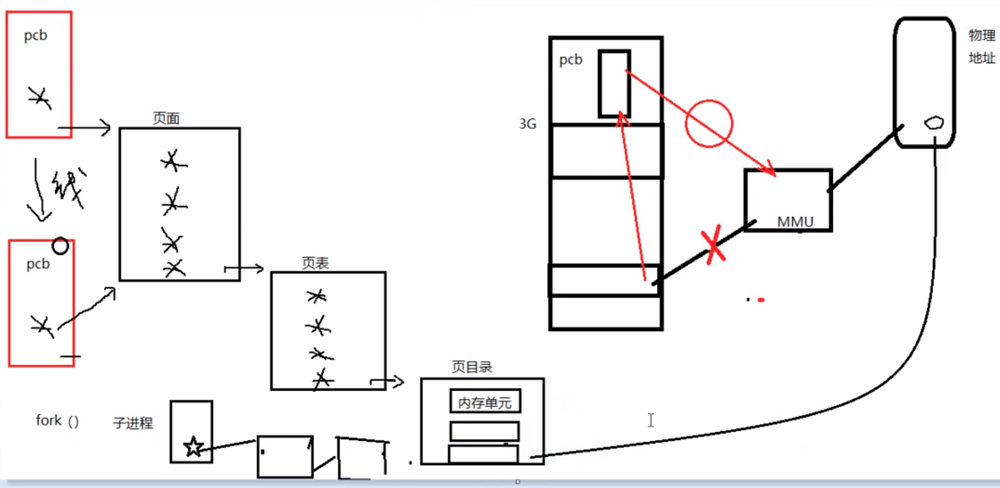

# 07_THREAD 

## 线程概念

​		图. 资源的最小单位

图. 进程和线程之间,  都有独立的pcb,但是进程没有相同的三级页表

线程概念: 

​		进程:有独立的 进程 地址空间. 有独立的pcb

​		线程: 有独立的pcb. 没有独立的进程地址空间.

​		ps -Lf 进程id   ---->线程号. LWP -->cpu 执行的最小单位

线程共享:

​		独享 栈空间(内核栈, 用户栈)   (errno)

​		共享 ./text ./ data ./rodata ./bss heap 共享:全局变量

线程控制原语:

​		pthread_t pthread_self(void);  // 获取线程id. 线程id 是在进程地址空间内部,用来标志线程身份的id号.

​		返回值: 本线程id

​		检查出错返回: 线程中perror无效

​			fprintf(stderr, "xxx error:%s \n", strerror(ret));

​		int pthread_create(rpthread_t *tid, const pthread_attr_t *attr, void\* (\*start_routn)(void\*), void \*arg);

​		参1:传出参数, 表新创建的子线程的线程id

​		参2:线程属性,传NULL表使用默认属性

​		参3:子线程回调函数. 创建成功, pthread_create函数返回时, 该函数会被自动调用

​		参4:参3的参数, 没有的话,传NULL

​			返回值: 成功:0	

​						失败:errno

循环创建N个子线程:

​				for(i = 0; i < 5; i++)

​						pthread_create(&tid, NULL, tfn, (void*)i); //将int类型i, 强转为void *, 传参.

​			void pthread_exit(void* retval);   退出当前线程

​				retval: 退出值. 无退出值时, NULL

​				exit(); 退出当前进程

​				return:  返回到调用这那里去 

​				pthread_exit();  退出当前线程

int pthread_join(pthread_t thread, void **retval); 回收线程. 阻塞!

​			thread: 待回收的线程id

​			retval: 传出参数. 回收的那个线程的退出值.

​						线程异常结束, 值为-1

​			返回值: 成功: 0

​						失败: errno

int pthread_detach(pthread_t thread);  设置线程分离

​			thread: 待分离的线程id

​			返回值: 成功: 0

​						失败: errno

int pthread_cancel(pthread_t thread); **杀死一个线程, 需要一个取消点(保存点),**

​			thread: 待分离的线程id

​			返回值: 成功: 0

​			失败: errno

​			如果, 子线程没有到达取消点, 那么pthread_cancel 无效.

​			我们可以在程序中,手动添加一个取消点. 使用pthread_testcancel();

​			成功被pthread_cancel() 杀死的线程, 返回 -1 , 使用pthread_join回收.

线程控制原语                                                       进程控制原语

pthread_create(); 												 fork();

pthread_self();                                                       getpid();

pthread_exit)();                                                     exit();               /return

pthread_join();                                                     wait() /waitpid();

pthread_cancel();                                                kill();

pthread_detach();

线程属性:

​			设置分离属性:

​			pthread_attr_t attr 创建一个线程属性结构体变量

​			pthread_attr_init(&attr);  初始化线程属性

​			pthread_attr_setdetachstate(&attr, PTHREAD_CREATE_DETACHED);  设置线程属性为分离态

​			pthread_create(&tid, &attr, tfn, NULL);  借助修改后的 设置线程属性, 创建为分离态的新线程

​			pthread_attr_destroy(&attr);  销毁线程属性

