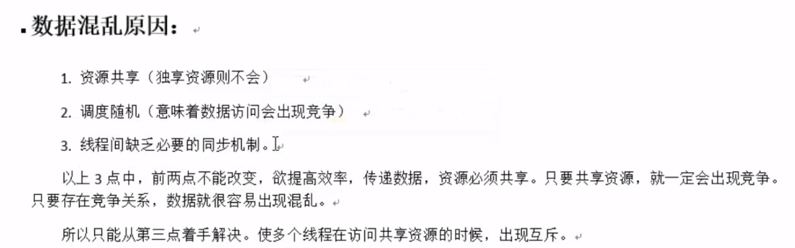
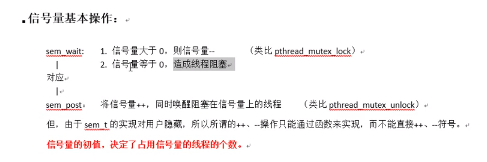

# 08_SYNCHRO

同步概念

线程同步: 协同步调, 对公共区域数据按需访问. 防止数据混乱, 产生与时间有关的错误. 

锁的使用:

​		建议锁! 对公共数据进行保护. 所有线程[应该]在访问公共数据前先拿锁再访问. 但, 锁本身不具备强制性.

使用mutex() 互斥量, 互斥锁 的 一般步骤:

1.pthread_mutex_t lock; 创建锁

2.pthread_mutex_init; 初始化

3.pthread_mutex_lock;加锁

4.访问共享数据(stdout);

5.pthread_mutex_unlock(); 解锁

6.pthread_mutex_destroy; 销毁锁

初始化互斥量

​		pthread_mutex_t mut;

​		1.pthread_mutex_init(&mut, NULL);  //动态初始化.

​		2.pthread_mutex_t mut = PTHREAD_MUTEX_INITIALIZE //静态初始化

注意事项:

​		尽量保证锁的粒度,越小越好. (访问共享数据前,加锁. 访问结束[立即]解锁)

​		互斥锁, 本质是结构体,我们可以看作是整数, 初值为1. (pthread_mutex_init() 函数调用成功)

​		加锁: --操作, 阻塞线程

​		解锁: ++操作, 唤醒阻塞在锁上的线程.

​		try锁: 尝试加锁, 成功-- . 失败,返回, 同时设置错误号EBUSY

restrict关键字:

​		用来限定指针变量. 被该关键字限定的指针变量所指向的内存操作,必须由本指针完成

死锁:

​		是使用锁不恰当导致的现象:

​		1.对一个锁反复lock.

​		2.两个线程,各自持有一把锁, 请求另一把.

1.反复加锁mutex

2.死锁

读写锁:

​		锁只有一把.  以读方式给数据加锁-- 读锁, 以写方式给数据加锁 --- 写锁

​		读共享,写独占   

​		写锁优先级高

​		相较于互斥量而言, 当**读**线程多的时候, 提高访问效率

​		pthread_rwlock_t rwlock;

​		pthread_rwlock_init(&rwlock, NULL);

​		pthread_rwlock_rdlock(&rwlock);  try版本

​		pthread_rwlock_wrlock(&rwlock);  try版本

​		pthread_rwlock_unlock(&rwlock);

​		pthread_rwlock_destroy(&rwlock);

条件变量:

​		本身不是锁! 但是通常结合锁来使用. mutex

​		pthread_cond_t cond;

​		初始化条件变量:

​		1.pthread_cond_init(&cond, NULL);   //动态初始化

​		2.pthread_cond_t cond = PTHREAD_COND_INITIALIZER;  //静态初始化

​		

pthread_cond_signal: 唤醒阻塞在条件变量上的 (至少)一个线程.

pthread_cond_broadcast: 唤醒阻塞在条件变量上的所有线程.

**[要求,能够使用条件变量来实现生产者消费者模型]**

信号量:  **应用与线程\进程间同步,** 与信号无关

​	相当于 初始化值为 n 的互斥量.  N值, 表示可以同时访问共享数据区的线程数.

​	函数:

​			sem_t sem;      定义类型

​			int sem_init(sem_t *sem, int pshared, unsigned int value);

​			参数: 

​					sem:信号量

​					pthread:    0 用于线程间同步

​										1 用于进程间同步

​					value: N值. (指定同时访问的线程数)

​			sem_destroy();

​			sem_wait();    一次调用, 做一次--- 操作, 当信号量的值为0 时,再次-- 就阻塞.(对比pthread_mutex_lock)

​			sem_post();  一次调用, 做一次++操作. 当信号量的值为N时, 再次++就会阻塞.(对比pthead_mutex_unlock)

`

生产者消费者模型

信号量实现生产者消费者模型

