# 01 网络基础

1.协议:

​		一组规则.

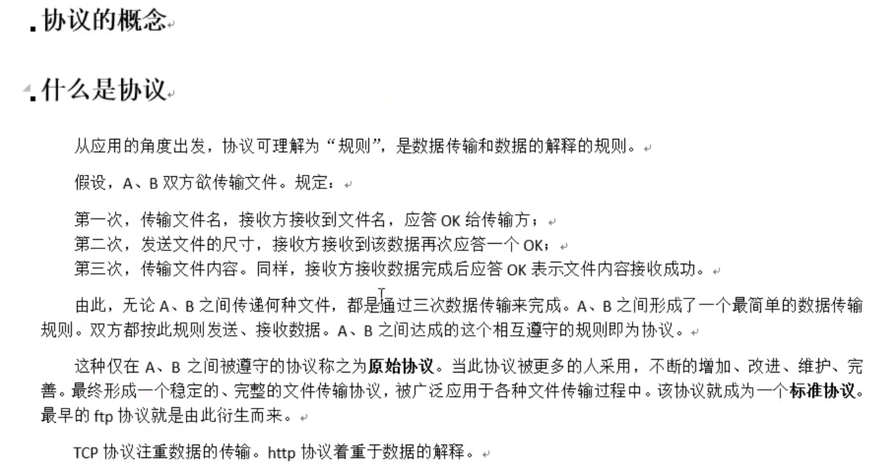

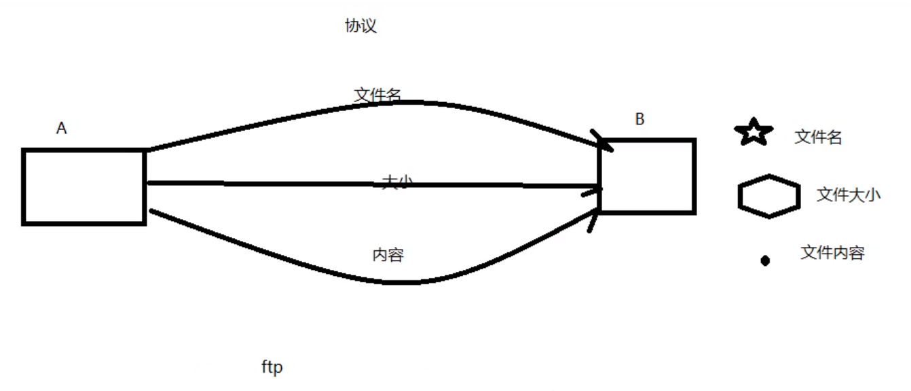

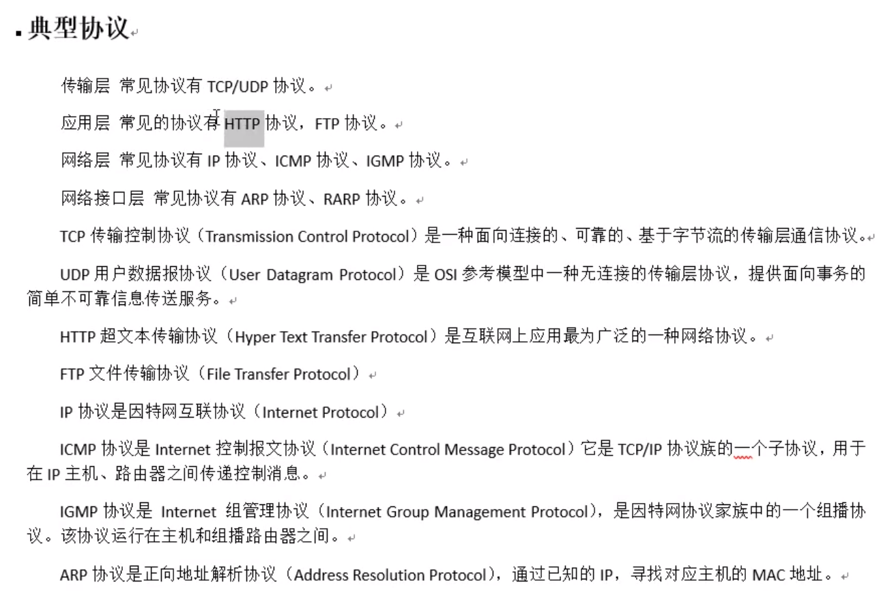

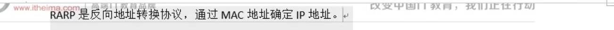

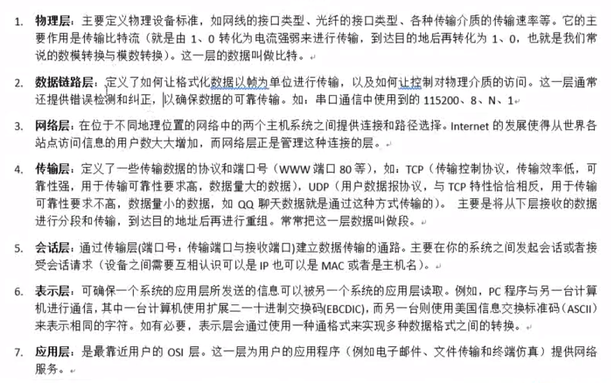

分层模型结构:

OSI七层模型: 物, 数, 网 , 传, 会, 表, 应 (物联网淑慧试用)

TCP/IP 4层模型: 网(链路层/网络接口层), 网, 传, 应

应用层: http, ftp, nfs , ssh, telnet....

传输层: TCP , UDP

网络层: IP, ICMP, IGMP

链路层: 以太网帧协议, ARP(这个不一定)

网络传输流程:

​		数据没有封装之前,是不能在网络中传递

以太网帧协议:

​		ARP协议: 根据IP地址获取 mac地址.

​		以太网帧协议, 根据mac地址完成数据包传输

IP协议:

​		版本: IPv4, IPv6

​		TTL: time to live. 设置数据包在路由节点中的跳转上限. 每经过一个路由节点, 该值-1, 减为0的路由, 有义务将该数据包丢弃.

​		源IP: 32位 ---4 字节    192.168.1.108 --- 点分十进制 IP地址(string) ---二进制

​		目的IP: 32位. ----4 字节

IP地址: 

​		可以在网络环境中表示唯一一台主机.

端口号:

​		可以在网络的一台主机上唯一标识一个进程.

IP+端口号:

​		可以在网络环境中,唯一标识一个进程.

UDP协议:

​		16位: 源端口号.  2^16 = 65535

​		16位: 目的端口号

TCP协议:

​		16位: 源端口号.  2^16 = 65535

​		16位: 目的端口号

​		32位 序号

​		32位 确认序号

​		6个标志位.

​		16位窗口大小 2^16 = 65536

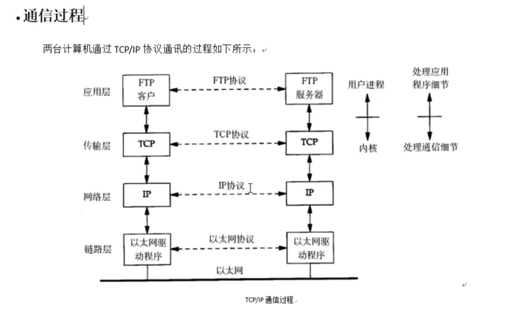

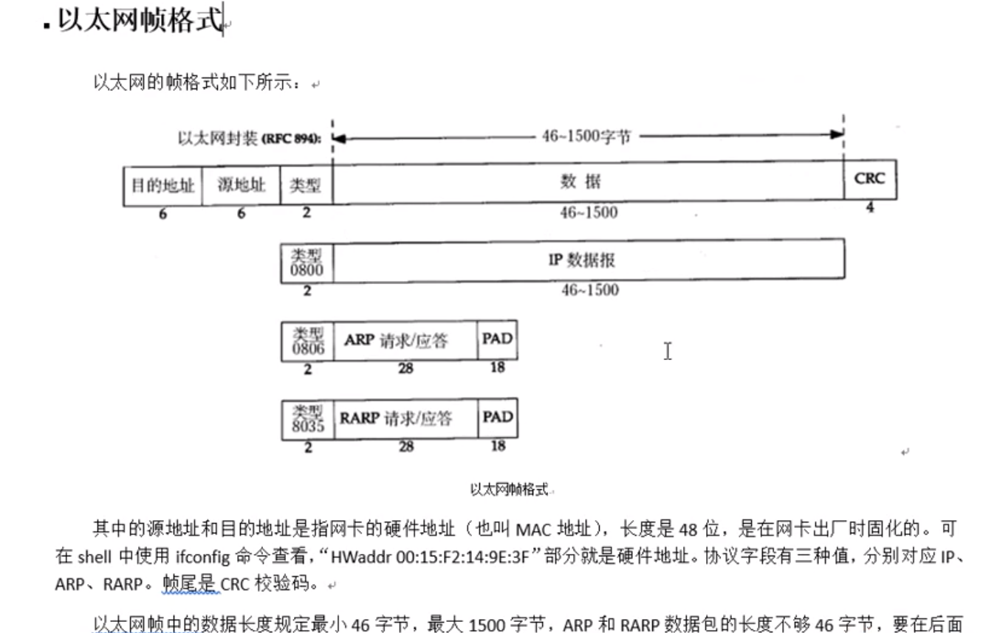

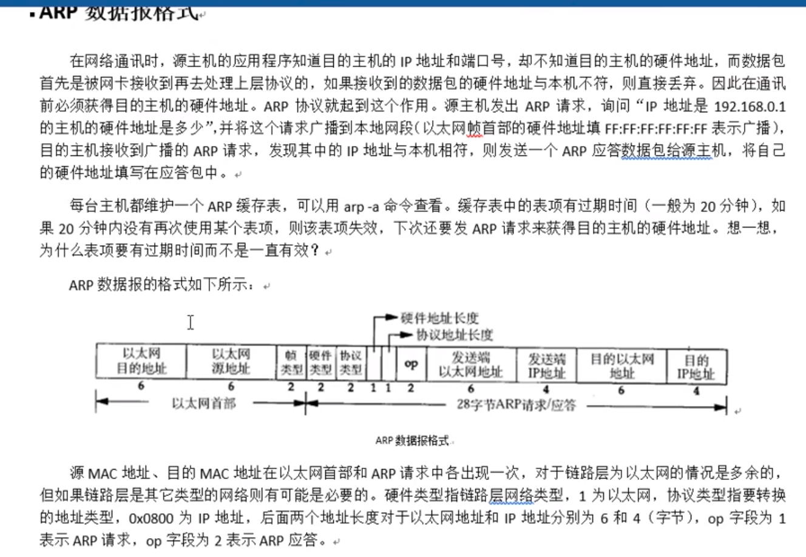

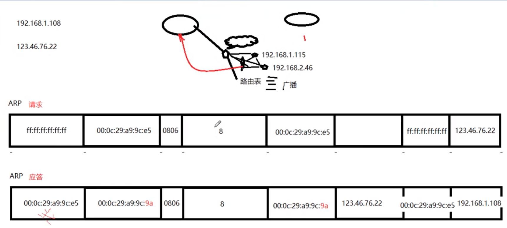

图 ARP请求

## IP段格式.

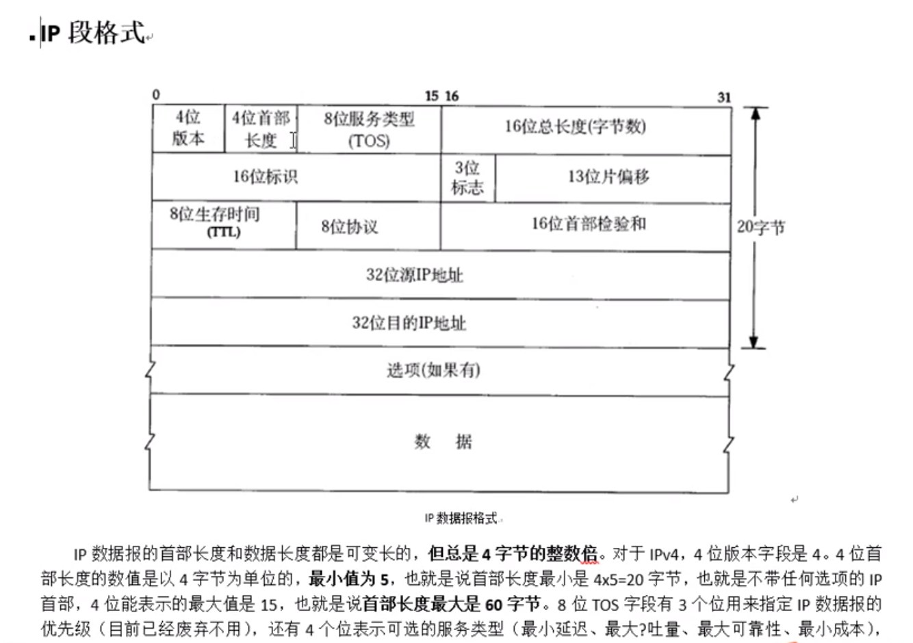

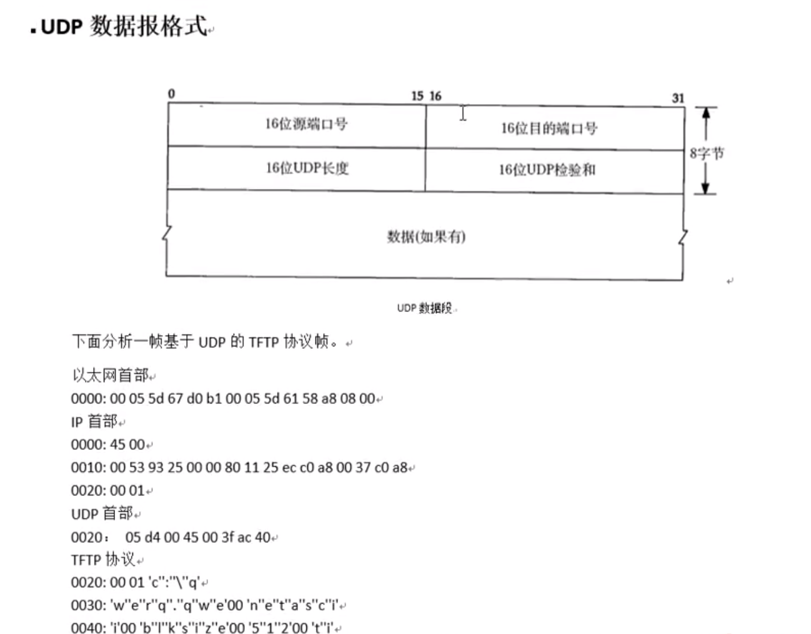

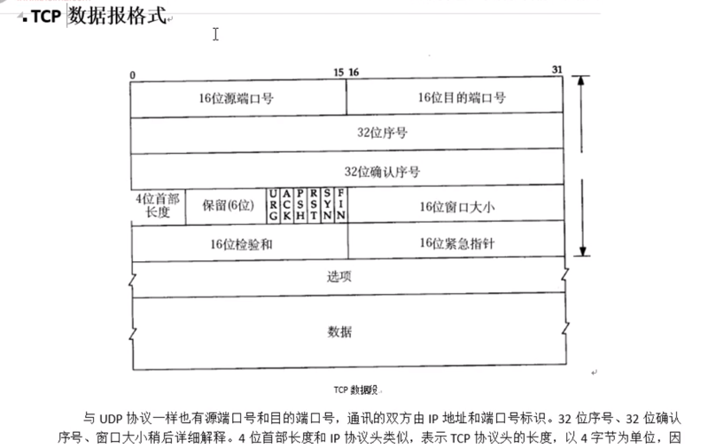