# 01 网络基础

1.协议:

​		一组规则.

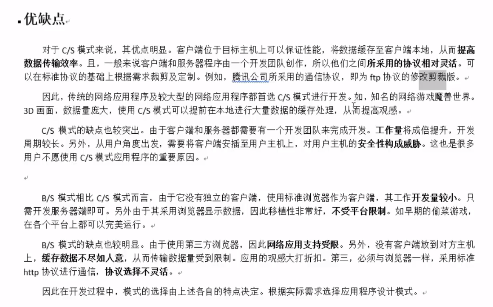

分层模型结构:

OSI七层模型: 物, 数, 网 , 传, 会, 表, 应 (物联网淑慧试用)

TCP/IP 4层模型: 网(链路层/网络接口层), 网, 传, 应

应用层: http, ftp, nfs , ssh, telnet....

传输层: TCP , UDP

网络层: IP, ICMP, IGMP

链路层: 以太网帧协议, ARP(这个不一定)

c/s模型: client-server

b/s模型:broswer-server

​			C/S                                                           B/S

​			优点: 缓存大量数据,协议选择灵活        安全性, 跨平台,  开发工作量小

​						速度快,        

​			缺点:  安全性,难跨平台,  开发工作量大    不能缓存大量数据,严格遵守http

网络传输流程:

​		数据没有封装之前,是不能在网络中传递

​		数据-应用层-传输层-网络层-链路层 - 网络环境

以太网帧协议:

​		ARP协议: 根据IP地址获取 mac地址.

​		以太网帧协议, 根据mac地址完成数据包传输

IP协议:

​		版本: IPv4, IPv6

​		TTL: time to live. 设置数据包在路由节点中的跳转上限. 每经过一个路由节点, 该值-1, 减为0的路由, 有义务将该数据包丢弃.

​		源IP: 32位 ---4 字节    192.168.1.108 --- 点分十进制 IP地址(string) ---二进制

​		目的IP: 32位. ----4 字节

IP地址: 

​		可以在网络环境中表示唯一一台主机.

端口号:

​		可以在网络的一台主机上唯一标识一个进程.

IP+端口号:

​		可以在网络环境中,唯一标识一个进程.

UDP协议:

​		16位: 源端口号.  2^16 = 65535

​		16位: 目的端口号

TCP协议:

​		16位: 源端口号.  2^16 = 65535

​		16位: 目的端口号

​		32位 序号

​		32位 确认序号

​		6个标志位.

​		16位窗口大小 2^16 = 65536

三次握手

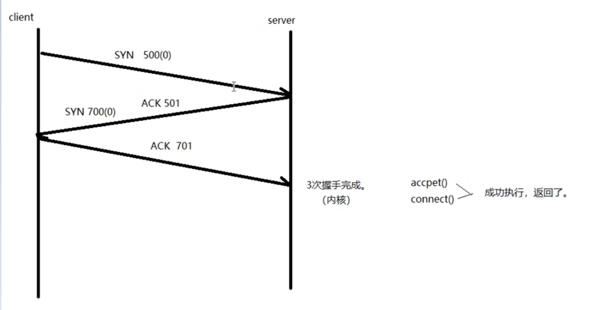

四次挥手

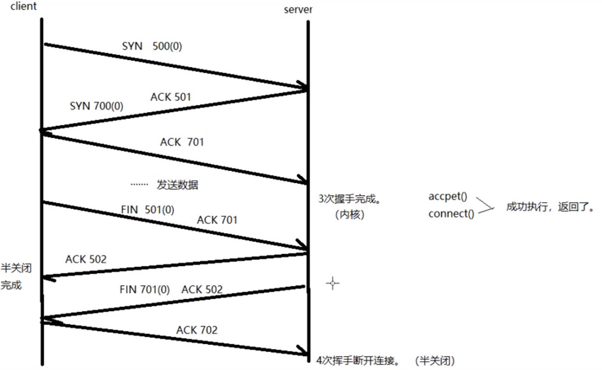

因为半关闭, 只是关闭数据的缓冲区, 所以需要四次挥手

TCP状态时序图:

​		1.主动发起连接请求端: CLOSE --- SYN ----SYN_SENT  ---接收ACK, SYN --- SYN_SENT  --- 发送ACK --- ESTABLISHED (数据通信态)

​		2.主动关闭连接请求端: ESTABLISHED(数据通信态) -- 发送FIN -- FIN_WAIT_1 --接收ACK --FIN_WAIT_2(半关闭) --接收对端发送FIN -- FIN_WAIT_2 (半关闭) --- 回发ACK -- TIME_WAIT(只有主动关闭连接一方才会经历) --- 等 2MSL时长 --CLOSE

​		3.被动接收连接请求端: CLOSE -- LISTEN --接收 SYN --LISTEN -- 发送ACK, SYN -- SYN_RCVD -- 接收ACK -- ESTABLISHED

​		4.被动关闭连接请求端: ESTABLISHED(数据通信态) --接收FIN -- ESTABLISHED(数据通信态) -- 发送ACK -- CLOSE_WAIT(说明对端[主动关闭连接端] 处于半关闭状态) -- 发送FIN -- LAST_ACK -- 接收ACK -- CLOSE

重点记忆: ESTABLISHED, FIN_WAIT_2 <--> CLOSE_WAIT, TIME_WAIT(2MSL);

netstat -apn | grep 端口号(或者进程名称)

2MSL时长:

​		一定出现在[主动关闭连接请求端] .    --- TIME_WAIT

​		保证, 最后一个ACK能成功被对端接收. (等待期间, 对端没收到我发的ACK, 对端会再次发送FIN请求.)

端口复用:

​		int opt = 1;    //设置端口服用

​		setsockopt(lfd, SOL_SOCKET, SO_REUERADDR, (void*)&opt, sizeof(opt));

半关闭:

​	 通信双方中, 只有一端关闭通信.   ---  FIN_WAIT_2

​	close(cfd);

​	shutdown(int fd, int how);

​				how: SHUT_RD 关读端

​							SHUT_WR 关写端

​							SHUT_RDWR 关读写

shutdown 在关闭多个文件描述符应用的文件时,采用全关闭法, close, 只关闭一个.

select多路IO转接:

​		原理: 借助内核,select来监听, 客户端连接, 数据通信事件.

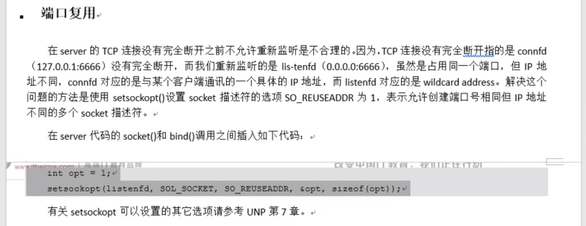

图 ARP请求

## IP段格式.

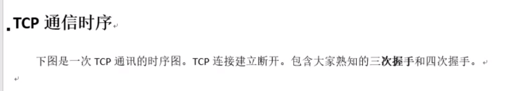

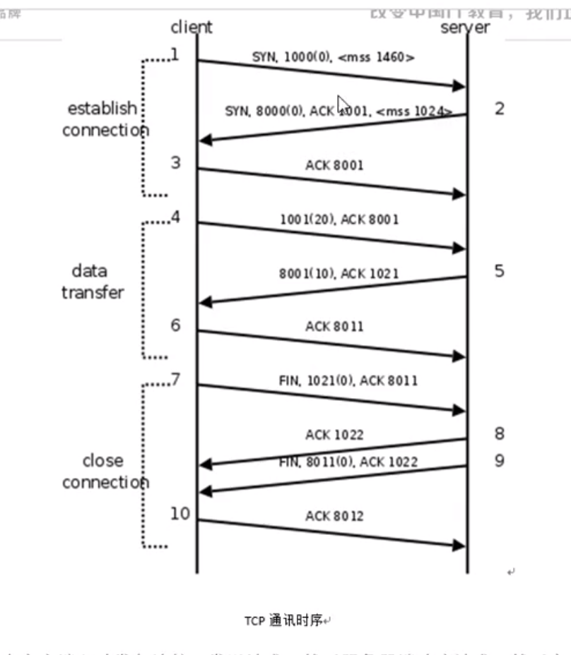

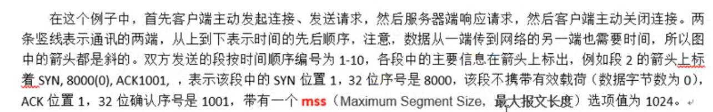

滑动窗口

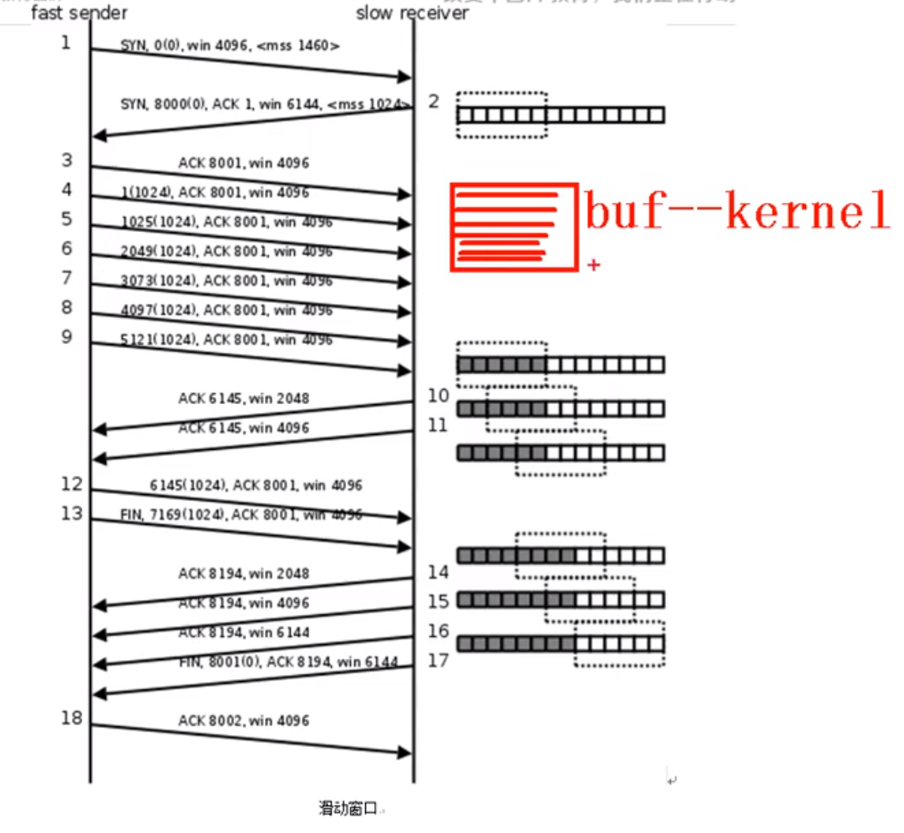

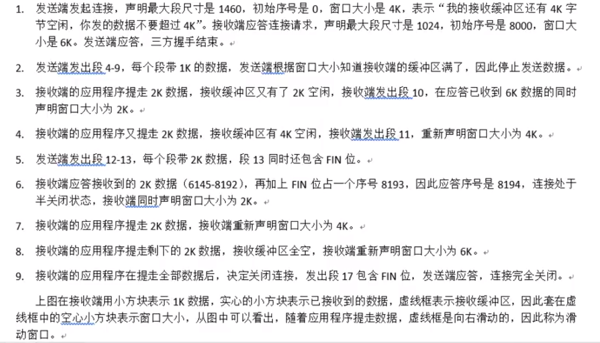

## TCP状态转换图

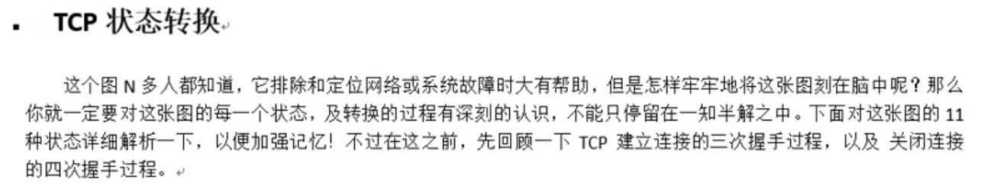

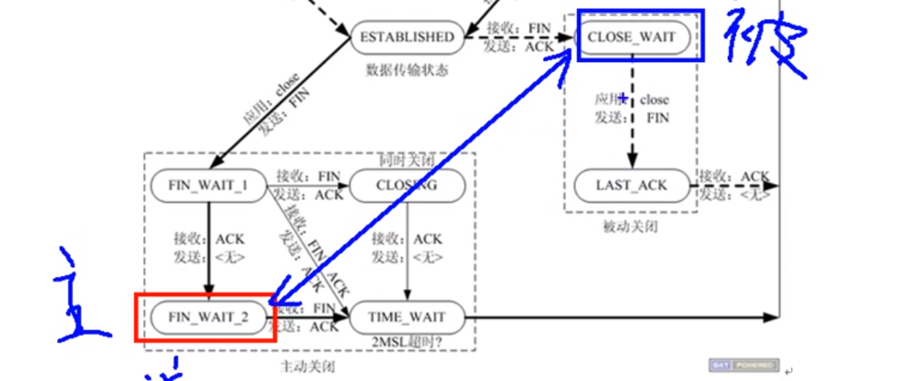

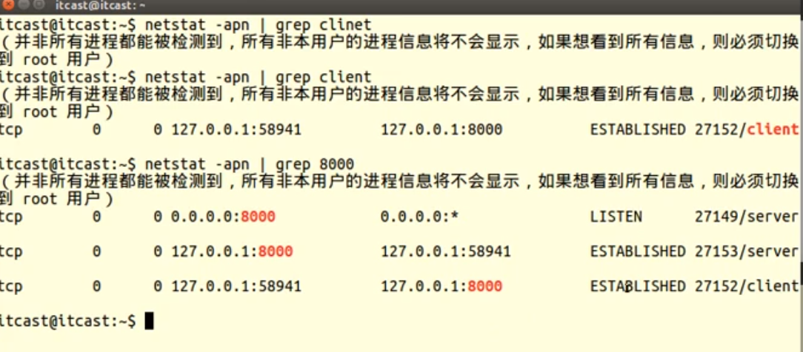

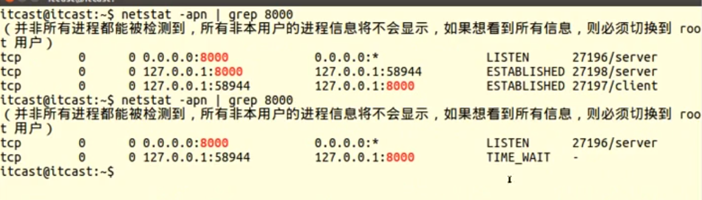

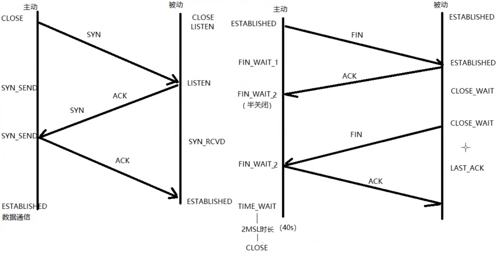

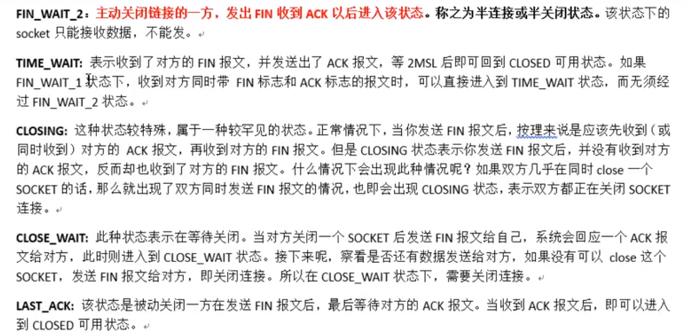

 

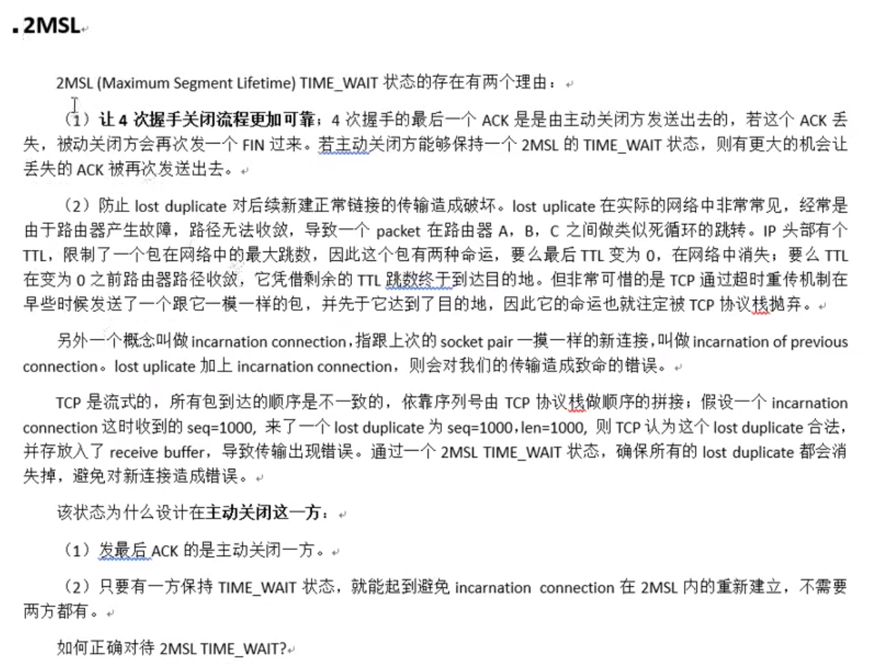

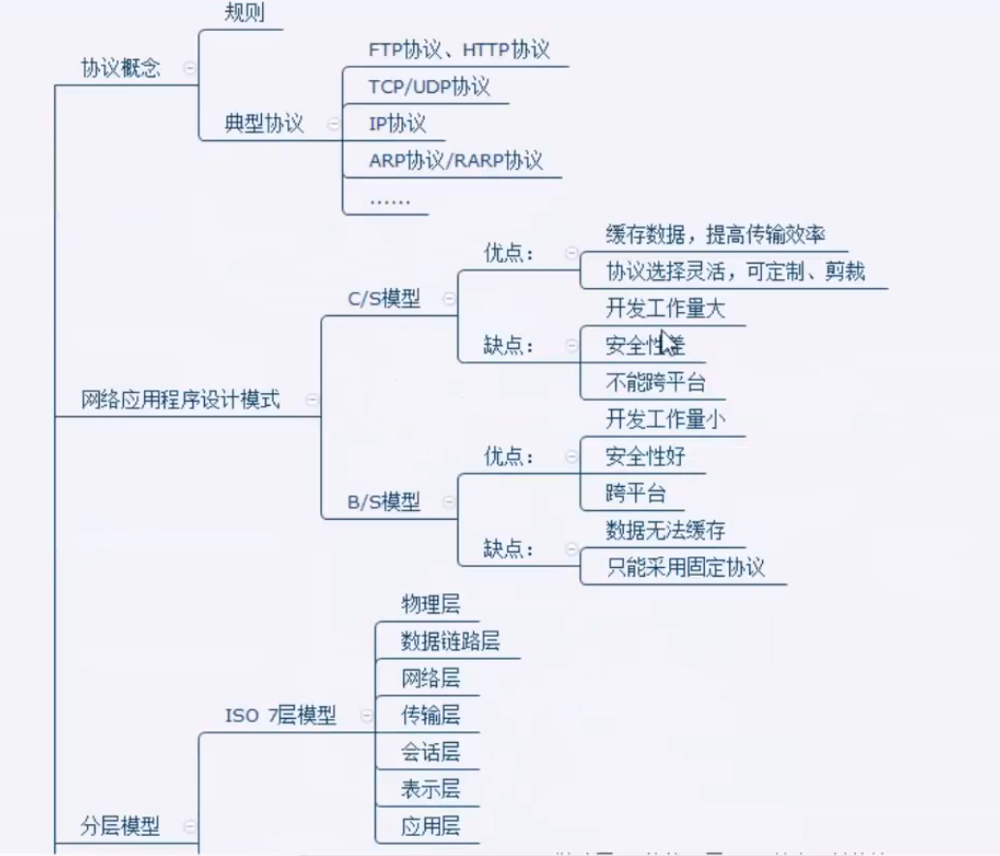

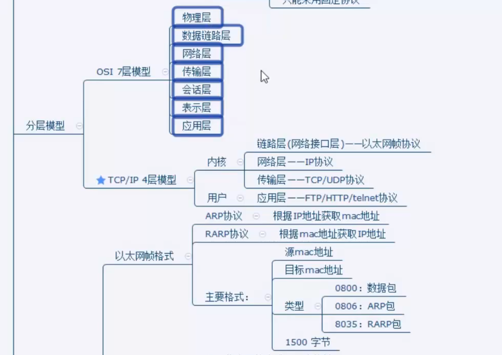

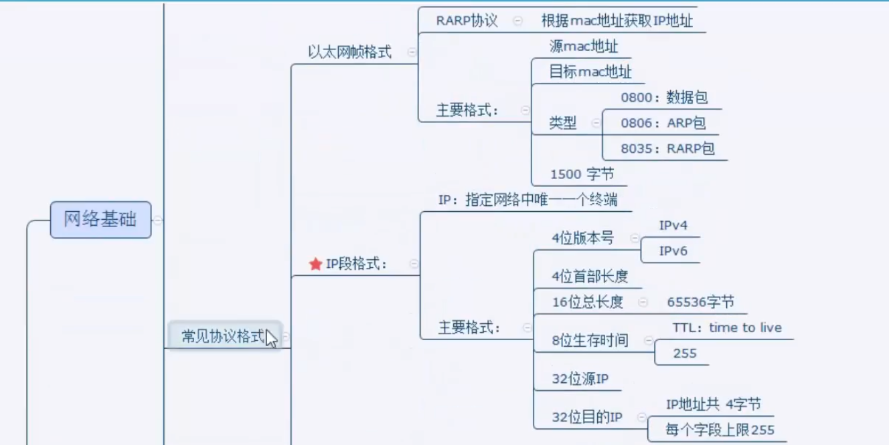

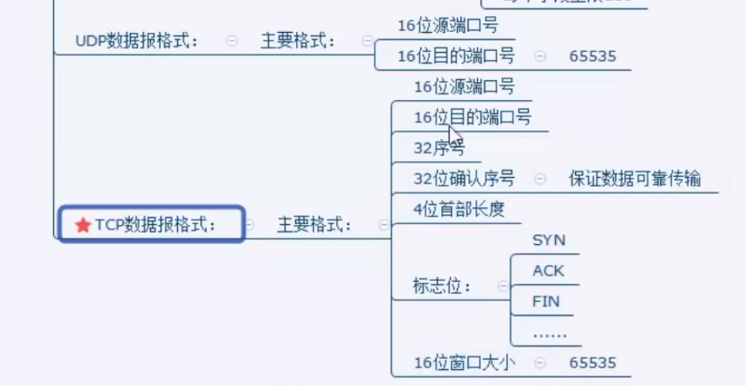

