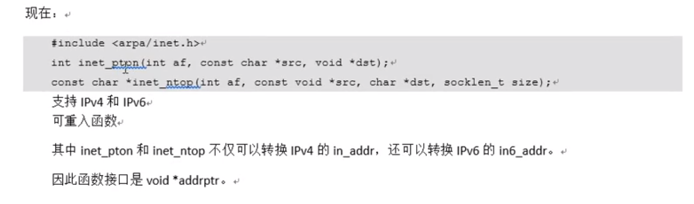

# 02_SOCKET 套接字

网络套接字: socket

​			一个文件描述符指向一个套接字(该套接字内部由内核借助两个缓冲区实现.)

​			在通信过程中, 套接字一定是成对出现的

网络字节序:

​			小端法: (pc本地存储)高位高地址. 低位存低地址  int a = 0x123456 78

​			大端法(网络存储):高位存低地址.低位存高地址. 		

​			htonl(uint32_t hostlong)  ---本地 ---> 网络(IP)    192.168.1.11 -->string -->atoi -->int -- htol -->网络字节序

​			htons  ----本地 ----> 网络(port)

​			ntohl --->网络 ---->本地(IP)

​			ntohs ---->网络 ----->本地(port)

IP地址转换函数:

​			int inet_pton(int af, const char *src, void *dst);   本地字节序(string IP) ----> 网络字节序

​			af: AF_INET, AF_INET6

​			src: 传入, IP地址(点分十进制)

​			dst: 传出, 转换后的网络字节序的 IP 地址

​			返回值:

​					成功: 1

​					异常: 0, 说明src指向的不是一个有效的ip地址

​					失败: -1

​		const char *inet_ntop(int af, const void *src,char *dst, socklen_t size);   网络字节序 ----> 本地字节序(string IP)

​			af: AF_INET, AF_INET6

​			src: 网络字节序IP地址

​			dst: 本地字节序(string IP)

​			size: dst的大小

​			返回值: 成功: dst

​						失败:NULL

sockaddr 地址结构:

 			struct sockaddr_in  addr

​			addr. sin_family = AF_INET/ AF_INET6

​			addr.sin_port = htons(9527);                         //man 7 ip

​						int dst;

​						inet_pton(AF_INET, "192.157.22.45", (void*)&dst)

​			addr.sin_addr.s_addr = dst;

​			**addr.sin_addr.s_addr = htonl(INADDR_ANY);**    //取出系统中有效的任意IP地址. 二进制类型


​			bind(fd, (struct sockaddr*)&addr, size);

socket函数:

#include <sys/socket.h>

int socket(int domain, int type, int protocol);  //创建一个套接字

​		domain : AF_INET , AF_INET6, AF_UNIX

​		type: SOCK_STREAM, SOCK_DGRAM

​		protocol: 0  

​		返回值: 

​				成功: 新套接字所对应的文件描述符

​				失败: -1 errno


​	#include <arpa/inet.h>

​		int bind(int sockfd, const struct sockaddr *addr, socklen_t addrlen); 给socket绑定一个 地址结构(IP+Port)

​		sockfd: socket 函数返回值

​						struct sockaddr_in addr;

​						addr.sin_family = AF_INET;

​						addr.sin_port = htons(8888);

​						addr.sin_addr.s_addr = htonl(INADDR_ANY);

​		addr: (struct sockaddr *)&addr   (传入参数)

​		addrlen: sizeof(addr) 地址结构的大小.


​				返回值: 

​							成功: 0

​							失败: -1 errno

  int listen(int sockfd, int backlog);   设置同时与服务器建立连接的上限数. 同时进行3次握手的客户端数量.

​		sockfd: socket 函数返回值

​		backlog: 上限数值. 最大值128.

​				返回值: 

​							成功: 0

​							失败: -1 errno	

 int accept(int sockfd, struct sockaddr *addr, socklen_t *addrlen);  阻塞等待客户端建立连接, 成功的话, 返回一个与客户端成功连接的socket文件描述符.

​		sockfd: socket 函数返回值

​		addr: 传出参数. 成功与服务器建立连接的那个客户端的地址结构.

​						socketlen_t: client_add_len = sizeof(addr);

​		addrlen: 传入传出. &client_addr_len

​					  入: addr的大小. 出: 客户端addr的实际大小.

​		返回值: 

​						成功:能与服务器进行数据通信的socket对应的文件描述符

​						失败: -1, errno

int connect(int sockfd, const struct sockaddr *addr, socklen_t addrlen);

​		作用: 使用现有的socket与服务器建立连接

​		sockfd: socket函数返回值

​					struct sockaddr_in srv_addr;     //用的服务器的地址结构

​					srv_addr.sin_family = AF_INET;

​					srv_addr.sin_port = 9527  跟服务器bind时设定的port完全一致

​					srv_addr.sin_addr.s_addr

​					inet_pton(AF_INET, "服务器的IP地址", &srv_addr.sin_addr);

​		addr: 传入参数. 服务器的地址结构,

​		addrlen: 服务器的地址结构大小.

​		返回值:

​				成功: 0

​				失败: -1 errno

​		如果不使用bind绑定客户端地址结构, 采用"隐式绑定".

TCP通信流程分析:

​		server:

​				1.socket()    创建socket

​				2.bind()   绑定服务器地址结构

​				3.listen()  设置监听上限

​				4.accept()  阻塞监听客户端连接

​				5.read()  读socket获取客户端数据

​				6.小--大写 toupper()

​				7.write(fd)

​				8.close(fd)

​			client:

​					1.socket()    创建socket

​					2.connect() 与服务器建立连接

​					3.write()     写数据到socket

​					4.read()     读转换后的数据.

​					5.显示读取结果

​					6.close(fd)  

三次握手:

​			主动发起连接请求端, 发送SYN标志位, 请求建立连接. 携带数据序号, 数据字节数(0), 滑动窗口大小

​			被动接受连接请求端, 发送ACK 标志位, 同时携带SYN请求标志位. 携带数据序号,确认序号,数据字节数(0), 滑动窗口大小.

​			主动发起连接请求端, 发送ACK标志位,应答服务器连接请求,携带确认序号.

四次挥手: 

​			主动关闭连接请求端: 发送FIN 标志位.

​			被动关闭连接请求端, 应答ACK 标志位.    ---------半关闭完成.

​			被动关闭连接请求端, 发送FIN 标志位.

​			主动关闭连接请求端, 应答ACK标志位  -----------连接全部关闭

滑动窗口:

​			发送给连接对端, 本端的缓冲区大小(实时), 保证数据不会发生丢失.

错误处理函数:

​		封装目的:

​				在server.c编程过程中突出逻辑, 将出错处理与逻辑分开, 可以直接跳转man手册.

​				wrap.c                                                                                 wrap.h

​				存放网络通信相关常用 自定义函数                                  存放网络通信相关常用 自定义函数原型(声明)

​				命名方式: 系统调用首字符大写, 方便查看man 手册

​									如: Listen(), Accept();

​				函数功能: 调用系统调用函数, 处理出错场景.

​				在server.c  和 client.c 中调用 自定义函数

​				联合编译 server.c 和 client.c 中调用 自定义函数

​								client.c 和 wrap.c 生成client

readn: 读N 个字节

readline:  读一行.

read 函数的返回值:

​		1.\>0 实际读到的字节数

​		2.=0 已经读到结尾(对端已经关闭) [! 重 !点!]

​		3.-1 应进一步判断errno的值:

​				errno = EAGAIN or EWOULDBLOCK : 设置了非阻塞方式, 读. 没有数据到达.

​				errno = EINTR 慢速系统调用被中断.

​				errno = "其他情况" 异常

多进程并发服务器:

​			1.socket();      创建 监听套接字 lfd

​			2.bind();  绑定地址结构 struct sockadar_in addr;

​			3.Listen();

​			4.while(1) {

​					cfd = Accept();

​					pid = fork();

​					if(pid == 0)   {   子进程 read () -----小 -> 大 write(cfd)

​									close(lfd);  关闭用于建立连接的套接字lfd

​									read();

​									小--大 (大小写转换)

​									write(); 

​					}

​					else if(pid > 0) {

​								close(cfd);    关闭用于与客户端通信的套接字 cfd

​								continue;

​					}

​			 }

5.子进程

​		close(lfd);	

​		read()

​		小 --- 大

​		write()

​	父进程:

​		close(cfd);

​		注册信号捕捉函数:  SIGCHLD

​		在回调函数中, 完成子进程回收

​				while(waitpid());


多线程并发服务器:  server.c

​			1.socket();      创建 监听套接字 lfd

​			2.bind();  绑定地址结构 struct sockadar_in addr;

​			3.Listen();

​			4.while(1) {

​					Accept(lfd, );

​					pthread_create(&tid, NULL, tfn, NULL);

​					pthread_detach(tid);   //pthread_join(tid, void**);  新线程----专用于回收子线程,join代表合并

​				}

​			5.子线程:

​					void tfn(void* arg)

​					{

​								close(lfd)

​								read(cfd)

​								小->大

​								write(read)

​								pthread_exit((void *) 10)

​					}

端口复用:

​		int opt = 1;    //设置端口服用

​		setsockopt(lfd, SOL_SOCKET, SO_REUERADDR, (void*)&opt, sizeof(opt));

select多路IO转接:

​		原理: 借助内核,select来监听, 客户端连接, 数据通信事件.


void FD_ZERO(fd_set *set); --- 清空一个文件描述符集合.

​			fd_set rset

​			FD_ZERO(&rset);

void FD_SET(int fd, fd_set *set);    ----将监听的文件描述符, 添加到监听集合中.

​			FD_SET(3, &rset);  FD_SET(5, &rset);   FD_SET(6, &rset);

void FD_CLR(int fd, fd_set *set);   ----将一个文件描述符从监听集合中移除.

​			FD_CLR(4, &rset);

  int FD_ISSET(int fd, fd_set* set);   --判断一个文件描述符是否在监听集合中;

​				返回值: 在:1, 不在:0

​				FD_ISSET(4, &rset);

int select(int nfds, fd_set* readfds, fd_set * writefds, fd_set* exceptfds, struct timeval* timeout);

​				nfds:监听的所有文件描述符中, 最大文件描述符+1

​				readfds: 读文件描述符监听集合    传入, 传出参数

​				writefds:写文件描述符监听集合          传入, 传出参数     NULL

​				exceptfds: 异常文件描述符监听集合       传入, 传出参数 NULL

​				timeout : >0 :设置监听时长.

​									NULL: 阻塞监听

​									0 : 非阻塞监听, 轮询

​				返回值:

​								>0  : 所有监听集合(3个) 中, 满足对应事件的总数.

​								=0  : 没有满足监听条件的文件描述符

​								-1  : errno

思路分析:

```C
			lfd = socket();   //创建套接字

​			bind();     //绑定地址结构

​			listen();    //设置监听上限

​			fd_set rset, allset;   //创建r读监听集合

​			FD_ZERO(&allset)   //将读r监听集合清空

​			FD_SET(lfd, &allset);    //将lfd添加至读集合中.

​			while (1) {


​			rset = allset;    //保存监听集合

​			ret = select(lfd+1, &rset, NULL, NULL, NULL);    //监听文件描述符集合对应事件

​			if(ret > 0) {                               //有监听的描述符满足对应事件

​					if( FD_ISSET(lfd ,&rset) ) {   //1在. 0不在

​								cfd = accept();   //建立连接, 返回用于通信的文件描述符

​								FD_SET(cfd,  &allset)  //添加到监听通信描述符集合中

​					}
    				for( i = lfd+1; i <= 最大文件描述符; i++){
                        FD_ISSET(i, &rset);    //有read, write 事件
                        read();
                        小 --大
                       	write();
                    }

​			}

}
```

select 优缺点:

​		缺点: 监听上限受文件描述符限制. 最大1024

​				检测满足条件的fd, 自己添加业务逻辑提高小, 提高了编码难度.

​		优点: 跨平台. win, linux , maxos , unix, 类unix, mips

字节序的小端大端存储


	





