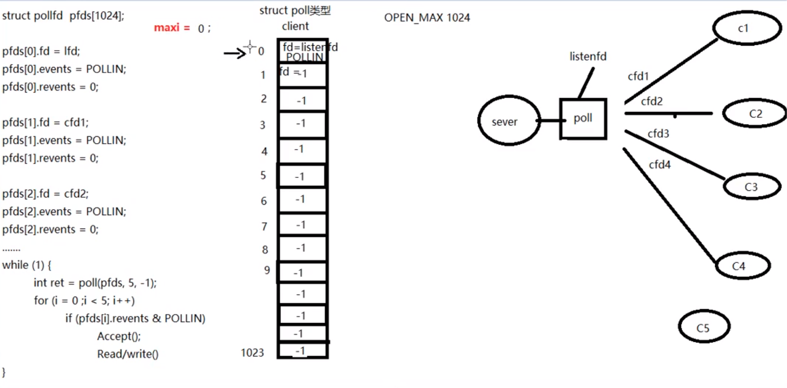
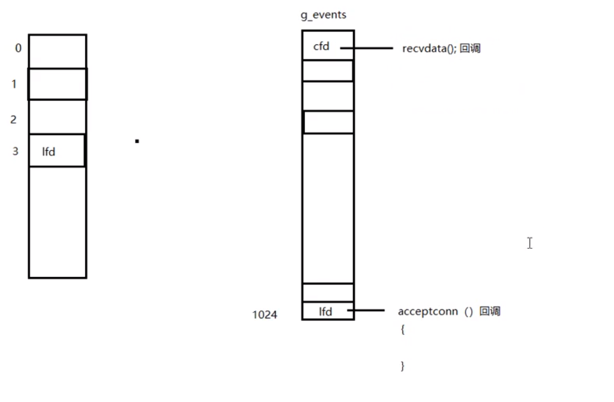
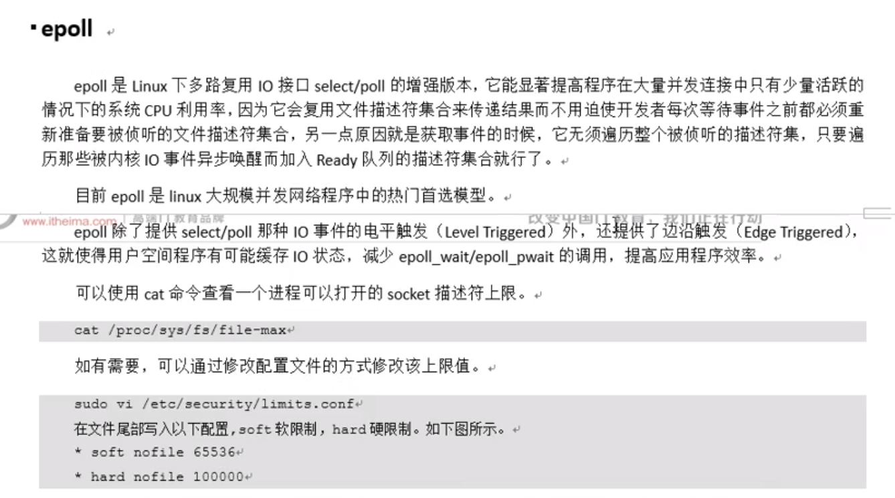
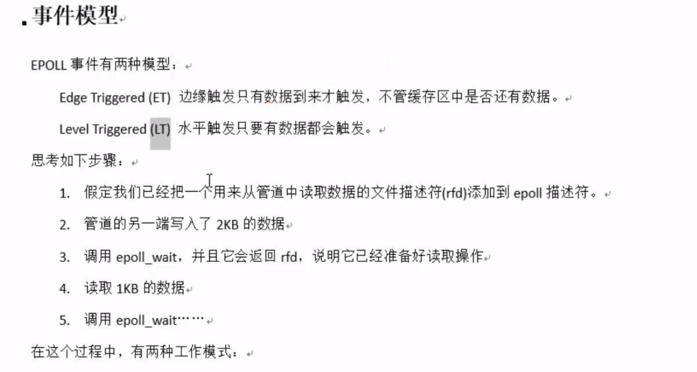
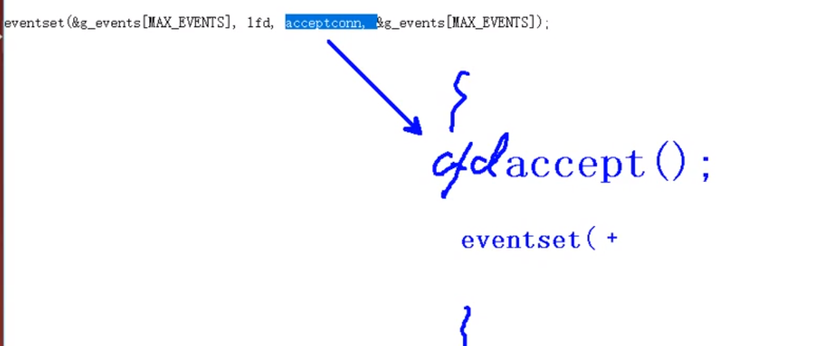
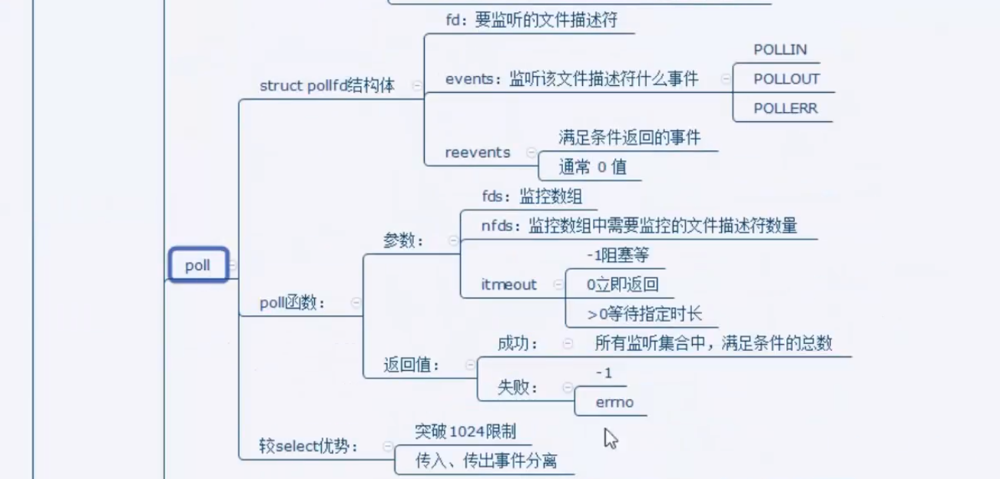
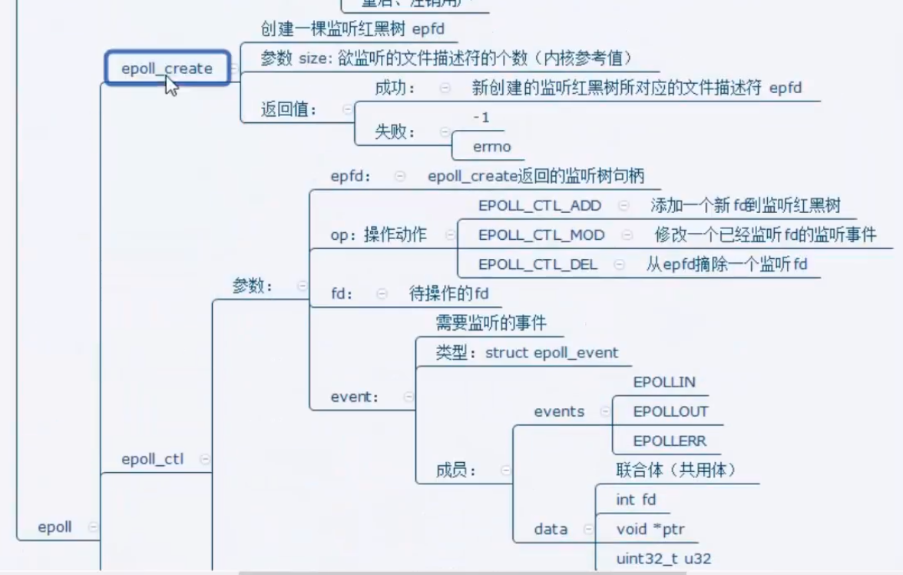
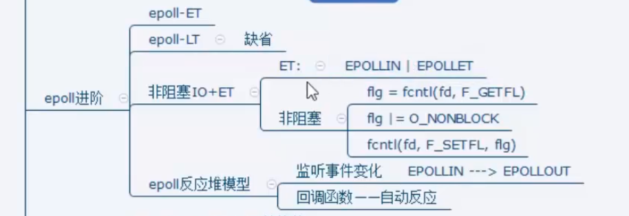

多路IO转接:

select:

​	

poll:

​			int poll(struct pollfd *fds, nfds_t nfds, int timeout);

​			fds:监听的文件描述符[数组]

​			struct pollfd {

​				int fd; 待监听的文件描述符

​				 shot events: 待监听的文件描述符对应的监听事件

​										取值:POLLIN, POLLOUT, POLLERR

​				short revnets: 传入时, 给0, 如果满足对应时间的话, 返回非 0 ---->POLLIN, POLLOUT, POLLERR

​			}

​			nfds: 监听数组的, 实际有效监听个数.

​			timeout:  > 0  超时时长. 单位毫秒

​							-1: 阻塞等待

​							0: 不阻塞

​							返回值: 返回满足对应监听事件的文件描述符总个数.

​			优缺点:

​					优点:

​							自带数组结构, 可以将监听事件集合和返回时间集合分离

​							拓展监听上限, 超出1024限制

​					缺点:

​							不能跨平台, 只能Linux

​							无法直接定位满足监听事件的文件描述符, 编码难度大

​							

read函数返回值:

​			> 0 : 实际读到的字节数

​			= 0 : socket中, 表示对端关闭. close()

   		 -1: 如果errno == EINTR 被异常中断. 需要重启

​				如果errno == EAGIN 或 EWOULDBLOCK 以非阻塞方式读数据, 但是没有数据,需要再次读.

​				如果 errno == ECONNREST 说明连接被重置.需要close(), 移除监听队列

​			错误

突破1024文件描述符限制

​		cat /proc/sys/fs/file-max  ->当前计算机所能打开的最大文件个数.受硬件影响.

​	ulimit -a  --> 但前用户下的进程, 默认打开的文件描述符个数. 缺省为1024

修改 : 打开sudo vi /etc/security/limits.conf, 写入:

\* soft 		nofile		65536    ---->设置默认值    , 可以直接借助命令修改 [注销用户],   使其生效.

\*hard		nofile		100000 --->命令修改上限

​			

epoll:

int epoll_create(int size);         创建一棵监听红黑树

​		size: 创建的红黑数的监听节点数量. **(仅供内核参考)**  可以扩容

​		返回值: 指向新创建的红黑树的根节点.

int epoll_ctl(int epfd, int op, int fd, struct epoll_event *event);  操作一棵监听红黑树

​		epfd:epoll_create函数的返回值. epfd

​		op:  对该监听红黑树所做的操作

​				EPOLL_CTL_ADD 添加fd到监听红黑树

​				EPOLL_CTL_MOD  修改fd在监听红黑树上的监听事件

​				EPOLL_CTL_DEL   将一个fd从监听红黑树上摘下	(取消监听)

​		fd:  

​				待监听的fd

​		event: 本质event struct epoll_event结构体 地址

​						events:

​								EPOLLIN, EPOLLOUT, EPOLLERR

​						data: 联合体

​								int fd;   对应监听事件的fd

​								void* ptr;

​										struct evt {

​												int fd;

​												void(* func) (int fd);  //自动回调

​										}*ptr;

​								uint32_t u32 

​								uint64_t u64

​		返回值: 

​					成功 0 

​					失败 -1  errno

int epoll_wait(int epfd, struct epoll_event* events, int maxevents, int timeout)

阻塞监听

​		epfd: epoll_create 函数的返回值. epfd

​		events: 传出参数[数组] , 满足 监听条件的那些 fd 结构体

​		maxevents: 数组 元素的 总个数.  1024 告知内核这个events有多大,不能大于epoll_create创建时的size

​				struct epoll_event events[1024];

​		timeout: 超时时间

​						-1: 阻塞

​						0: 立即返回, 非阻塞

​						<0: 指定毫秒

​		返回值:

​						>0 : 满足监听的总个数. 可以用作循环上限

​						0: 没有fd 满足监听事件

​						-1: 失败:设置errno

epoll实现多路IO转接思路:

lfd = socket();   //监听连接事件lfd

bind();

listen();

int epfd = epoll_create(1024);         //epfd, 监听红黑树的树根

struct epoll_event tep, ep[1024];  // tep, 用来设置单个fd属性, ep是epoll_wait() 传出的满足监听事件的数组

tep.events = EPOLLIN;

tep.data.fd = lfd

epoll_ctl(epfd, EPOLL_CTL_ADD, lfd, &tep);

while(1) {	

​	nready = epoll_wait(epfd, ep, 1024, -1);  实施监听

​	for(i = 0; i < nready；i++) {

​			if(ep[i].data.fd == lfd) {  //lfd 满足读事件, 有新的客户端发起连接请求

​					cfd = Accept();

​					tep.events = EPOLLIN;

​					tep.data.fd =cfd;

​					epoll_ctl(epfd, EPOLL_CTL_ADD, cfd, &tep);

​			}

​			else {         cfd 中 存在 满足读事件, 有客户端写数据来

​					 n  = read(ep[i].data.fd, buf, sizeof(buf));

​					if(n == 0) {

​								close(ep[i].data.fd);

​								epoll_ctl(epfd, EPOLL_CTL_DEL, ep[i].data.fd, NULL);   //将关闭的cfd, 从监听树上摘下					

​					}

​					else if (n > 0) {

​							小 -- 大

​							write(ep[i].data.fd, buf, n);

​					}

​			}

​	}

}

epoll 时间模型:

​		ET模式:

​				边沿触发 :

​							缓冲区剩余未读尽的数据不会导致epoll_wait返回. 新的数据满足,才会触发.

​							struct epoll_event event;

​							event.events = EPOLLIN | EPOLLET;

​		LT模式:

​				水平触发  -- 默认采用模式

​							缓冲区剩余未读尽的数据会导致epoll_wait 返回.

​		结论:

​				epoll的ET模式, 高效模式, 但是只支持, 非阻塞模式.   ----忙轮询 **(为什么一定要非阻塞)**

​							struct  epoll_event event;

​							event.events = EPOLLIN | EPOLLET; 

​							epoll_ctl(epfd, EPOLL_CTL_ADD, cfd, &event);

​							int flg = fcntl(cfd, F_GETFL);

​							flg |= )_NON_BLOCK

​							fcntl(cfd, F_SETFL, flg);

​			优点: 高效, 能突破1024描述符

​			缺点: 

​					不能跨平台, 只支持Linux.

epoll 反应堆模型:  详细见:https://blog.csdn.net/daaikuaichuan/article/details/83862311

​			epoll ET模式 + 非阻塞 , 轮询+ void * ptr

​			原来: 

​					socket, bind , listen -- epoll_create 创建监听 红黑树 -- 返回 epfd -- 调 epoll_ctl()  向树上添加一个监					听fd -- while(1) -- epoll_wait 监听 -- 对应监听描述符fd 有时间产生 -- 返回 监听满足数组. -- 判断返回					数组元素  -- lfd 满足 -- Accept()    --- cfd 满足 --- read() ----- 小 --> 大 --- write 写回去

​			反应堆:   不但要监听 cfd 的读时间, 还要监听cfd的写事件

​					socket, bind , listen -- epoll_create 创建监听 红黑树 -- 返回 epfd -- 调 epoll_ctl()  向树上添加一个监					听fd -- while(1) -- epoll_wait 监听 -- 对应监听描述符fd 有时间产生 -- 返回 监听满足数组. -- 判断返回					数组元素  -- lfd 满足 -- Accept()    --- cfd 满足 --- read() ----- 小 --> 大 --- cfd 从监听红黑树上摘下 -- 					EPOLLOUT -- 回调函数 -- epoll_ctl() --- EPOLL_CTL_ADD  重新放到红黑树上监听写事件.  --等待 					epoll_wait 返回 -- 说明 cfd 可写 -- write回去  -- cfd 从监听红黑树上摘下 -- EPOLLIN -- epoll_ctl -- 					EPOLL_CTL_ADD 重新放到红黑树上监听读事件  -- epoll_wait 监听

eventset函数:

​			设置回调函数: lfd ---> acceptconn()

​									cfd ---> recvdata()

​									cfd --> senddata();

eventadd函数:

​			将一个fd,添加到监听红黑树. 设置监听read事件, 还是监听write事件.

网络编程中: read --- recv()

​					write --- send()

