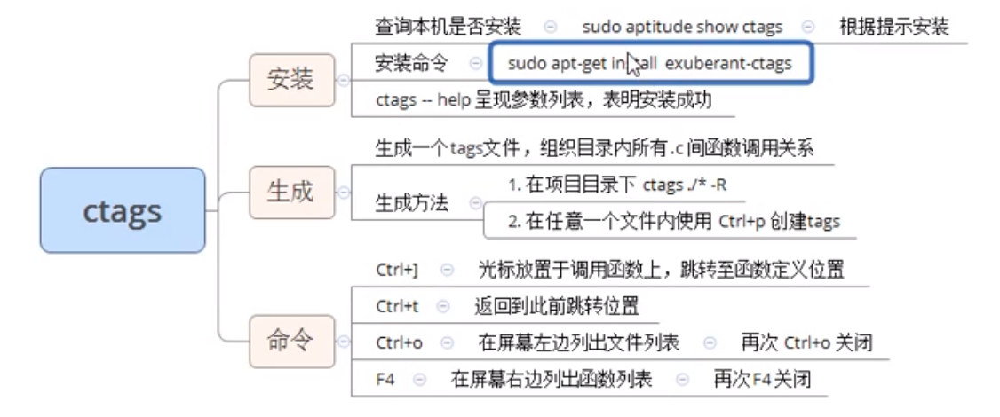
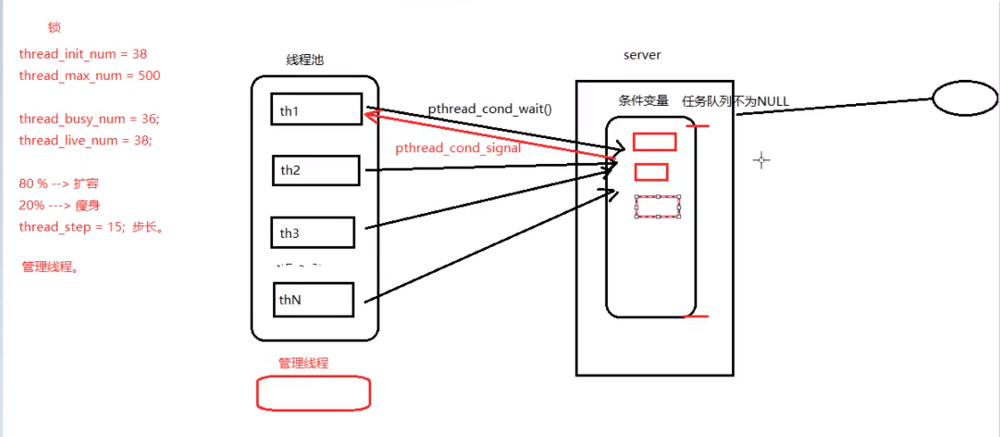
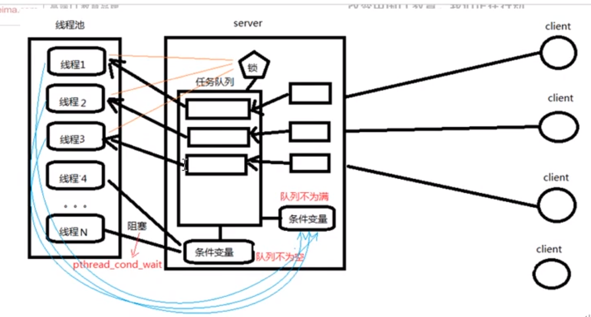
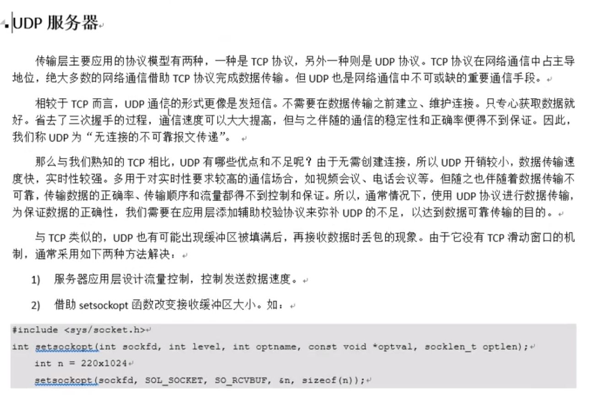
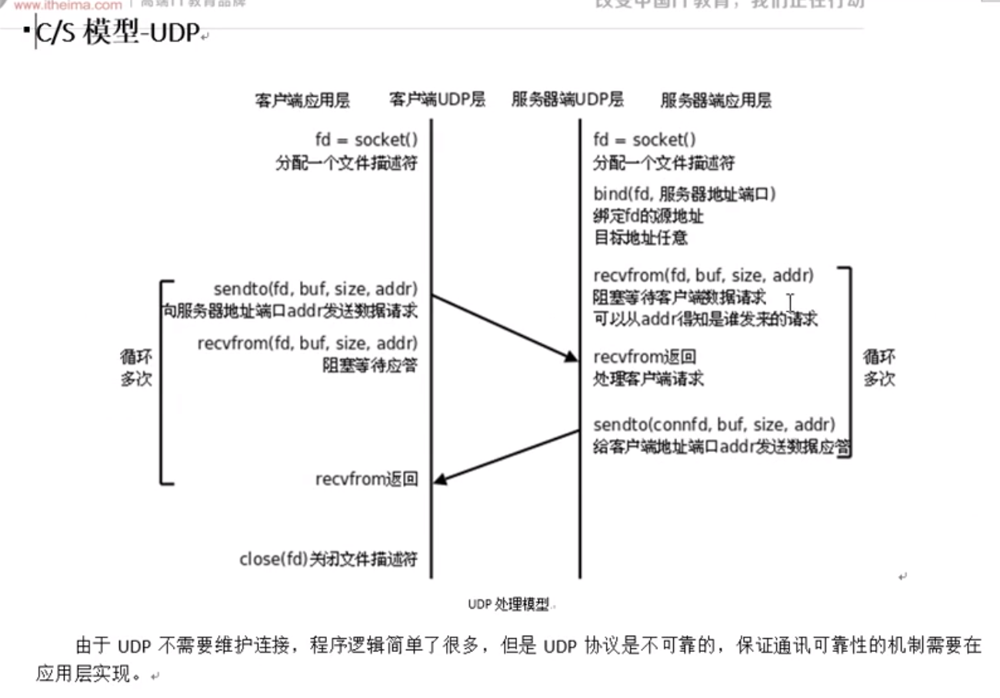
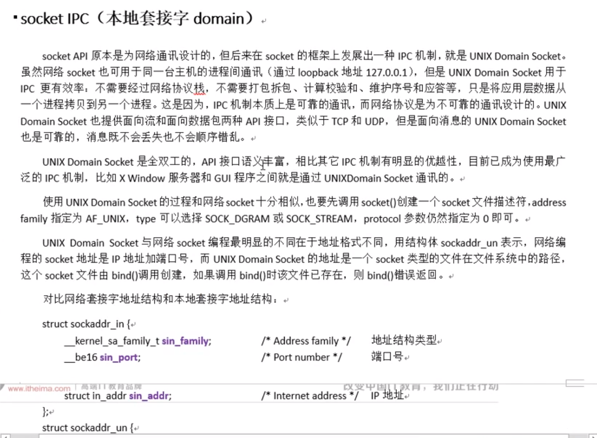
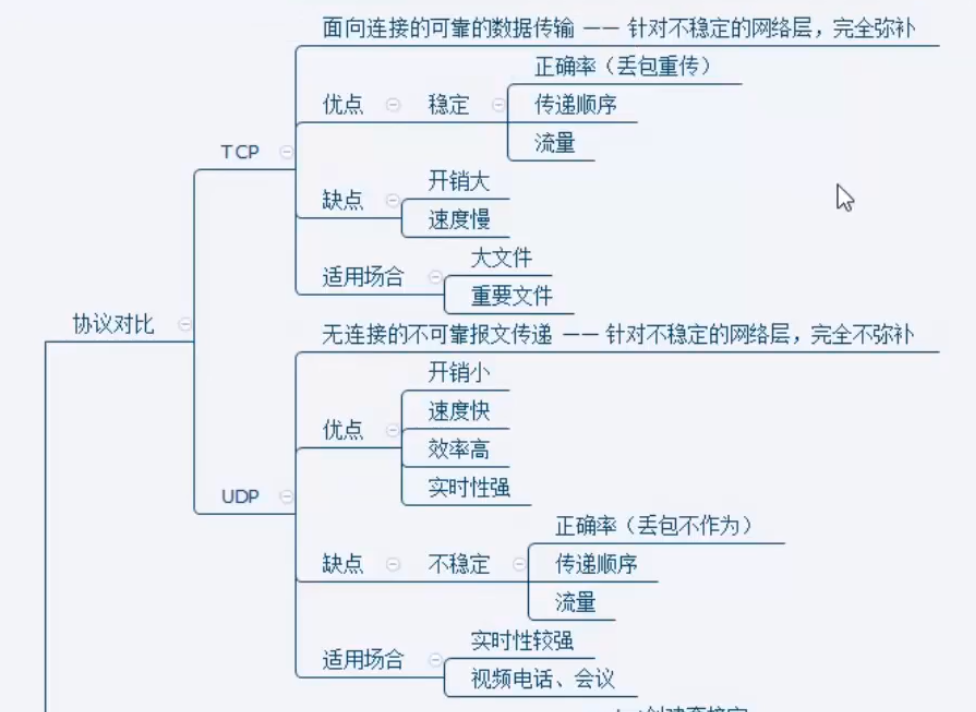
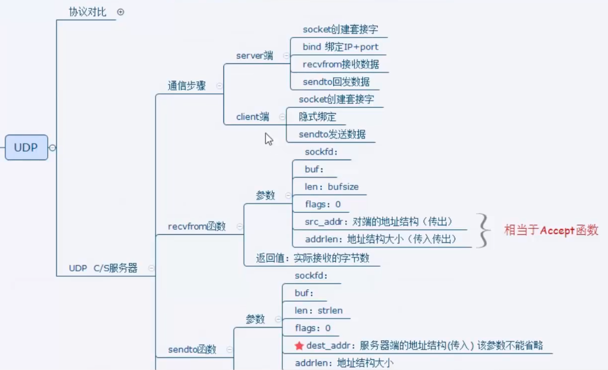
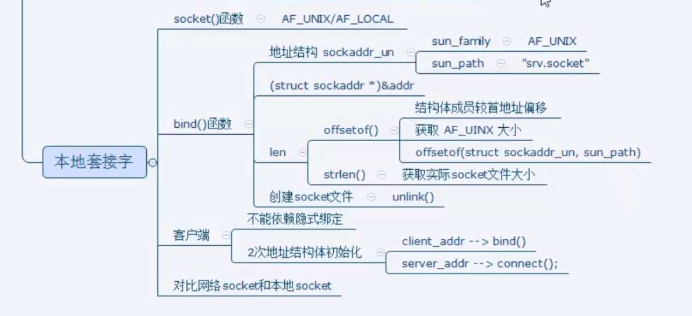

# 04 threadpool  线程池

## 1.ctags 函数跳转




```C
struct ypedef struct {
    void *(*function)(void *);  //函数指针, 回调函数
    void *arg;          //上面函数的参数
}  threadpool_task_t;    //各子线程任务结构体

/* 描述线程池相关信息 */
struct threadpool_t {
	pthread_mutex_t lock;       //用于锁住本结构体
    pthread_mutex_t thread_counter;    // 记录忙状态线程个数的锁 --busy_thr_num

    pthread_cond_t queue_not_full;   //任务队列满时, 添加任务的线程阻塞,等待此条件变量
    pthread_cond_t queue_not_empty;   // 当任务队列里不为空时, 通知等待任务的线程

    pthread_t* threads;    //存放线程池中每个线程的tid. 数组
    pthread_t* adjust_tid;   //存管理线程tid
    
    threadpool_task_t* task_queue; //任务队列(数组首地址)

    int min_thr_num;   //线程池最小线程数
    int max_thr_num;  //线程池最大线程数
    int live_thr_num;  //当前存活线程个数
    int busy_thr_num;  //忙状态线程个数
    int wait_exit_thr_num;  //要销毁的线程个数

    int queue_front;   //task_queue队头下标
    int queue_rear;   //task_queue队尾下标
    int queue_size;   //task_queue队中实际任务数
    int queue_max_size;    //task_queue队列可容纳任务数上限

    int shutdown;    //标志位, 线程池使用状态, true或false;
}
```







线程池模块分析:

​		1.main();

​					创建线程池.

​					向线程池中添加任务.  借助回调处理任务

​					销毁线程池

​		2.pthreadpool_create();	 

​					创建线程池结构体 指针

​					初始化线程池结构体 {N 个 成员变量}

​					创建 N 个任务线程

​					创建 1 个管理者线程.

​					失败时, 销毁开辟的所有空间(释放)

​		3.threadpool_thread()

​					进入子线程回调函数.

​					接收参数 void*arg --> pool结构体

​					加锁 --> lock --> 整个结构体锁

​					判断条件变量 --> wait  ---

​		4.adjust_thread()

​					循环10s 执行一次击

​					进入管理者线程回调函数

​					接收参数void * arg  ---> pool 结构体

​					加锁 ---> lock ---> 整个结构体锁

​					获取管理线程池要用的到的变量. task_num live_num, busy_num

​					根据既定算法, 使用上述3个变量, 判断是否应该 创建, 销毁线程池中指定步长的线程

​		5.threadpool_add()

​					总功能:

​								模拟产生任务.   num[20]

​								设置回调函数, 处理任务.  程序中用sleep(1)代表处理完成

​					内部实现:

​								加锁

​								初始化 任务队列结构体成员. 回调函数function, arg

​								利用环形队列机制, 实现添加任务. 借助队尾指针挪移 %  实现

​								唤醒阻塞在 条件变量上的线程

​								解锁

​		6.从3. 中的wait之后继续执行, 处理任务.

​				加锁

​				 获取 任务处理回调函数, 及参数

​				利用环形队列机制, 实现处理任务. 借助队头指针挪移 % 实现.

​				唤醒阻塞 在条件变量上的server.

​				解锁

​				加锁

​				改 忙线程数++

​				解锁

​				执行处理任务的线程

​				加锁

​				改 忙线程数--

​				解锁

​		7.创建 销毁线程

​					管理者线程 task_num , Live_num , busy_num

​					根据既定算法, 使用上述3变量, 判断是否应该, 创建, 销毁线程池中 指定步长的线程. 

​					如果满足 创建条件

​								pthread_create();    回调 任务线程函数.   live_num++

​					如果满足 销毁条件  wait_exit_thr_num = 10; 

​					signal 给 阻塞在条件变量上的线程 发送 假条件满足信号

​					跳转至   -- 170 wait 阻塞线程会被假线程唤醒. 判断: wait_exit_thr_num > 0  pthread_exit();

​					

上述步骤详见https://blog.csdn.net/qq_36359022/article/details/78796784#commentBox			

​					

TCP通信 和UDP通信各自 的 优缺点:

​			TCP: 面向连接的, 可靠数据报传输.  对于不稳定的网络层, 采取完全弥补的通信方式. 丢包重传

​					优点: 

​							稳定.

​										数据流量稳定, 速度稳定, 顺序

​					缺点:

​							传输速度慢, 效率低, 开销大.

​					使用场景: 数据的完整性要求较高, 不追求效率.

​									大数据传输, 文件传输.						

​			UDP:无连接的, 不可靠的数据报传递.  对于不稳定的网络层, 采取完全不弥补的通信方式. 默认还原网络状况

​					优点: 

​							传输速度快, 效率高, 开销小.

​					缺点:

​							不稳定.

​										数据流量, 速度, 顺序. 

​					使用场景: 对时效性要求较高的场合. 稳定性其次

​										游戏, 视频会议, 视频电话.      腾讯, 华为, 阿里    --- 应用层数据校验协议, 弥补udp的不足.

UDP实现的 C/S 模型

​		recv() / send() 只能用于TCP通信. 替代read, write

​		accept();  ----- connect(); ---被舍弃

​		server:

​					lfd = socket(AF_INET, SOCK_DGRAM, 0);       SOCK_DGRAM----报式协议

​					bind();

​					listen();    ------可有可无

​					while (1) {

​								read(cfd, buf, sizeof)   --被替换  --- recvfrom  --涵盖accept 传出地址结构体.

​										ssize_t recvfrom(int sockfd, void *buf, size_t len, int flags, struct sockaddr *src_addr, socklen_t *addrlen);

​										sockfd: 套接字

​										buf : 缓冲区

​										len: 缓冲区大小

​										flags: 0

​										src_addr: (struct sockaddr* ) & addr 传出, 对端地址结构

​										addrlen: 传入传出.

​										返回值: 成功接收数据字节数. 失败 -1 errno.    0: 对端关闭

​								小 -- 大

​								write()；  ----被替换 ---- sendto

​										ssize_t sendto(int sockfd, **const** void *buf, size_t len, int flags, const struct sockaddr *dest_addr, socklen_t addrlen);

​										sockfd: 套接字

​										buf : 存储数据的缓冲区

​										len: 数据长度

​										flags: 0

​										src_addr: (struct sockaddr* ) & addr 传入, 目标地址结构

​										addrlen: 地址结构长度.

​									返回值:成功写出字节数. 失败 -1 errno

​					}

​					close();

​		client:

​					connfd = socket(AF_INET, SOCK_DGRAM, 0);

​					sendto('服务器的地址结构', 地址结构大小)  

​					

​					recvfrom()

​					写到屏幕

​					close();

​	

本地套接字:

​		IPC: pipe, fifo, mmap, 信号, 本地套(domain)  --CS模型

​		

​		对比网络编程 TCP C/S模型, 注意以下几点:

​		1.int socket(int domain, int type, int protocal); 

​					参数domain: AF_INET -->AF_UNIX/AF_LOCAL

​							type: SOCK_STREAM/SOCK_DGRAM 都可以.

​		2.地址结构: sockaddr_in -->sockaddr_un;

​		struct sockaddr_in srv_addr;

​		srv_addr.sin_family = AF_INET;    --- srv_addr.sun_family = AF_UNIX;

​		srv_addr.sin_port = htons(8888);  ----   strcpy(srv_addr.sun_path," srv.socket")

​		srv_addr.sin_addr.s_addr = htonl(INADDR_ANY);             len = offfsetof(struct sockaddr_un, sun_path)+ strlen("srv.socket")

​		bind(fd, (struct sockaddr*)&srv_addr, sizeof(srv_addr));    --> bind(fd, (struct sockaddr\*)&srv_addr,  len);

​		3.bind()函数调用成功, 会创建一个socket, 因此为保证bind成功, 通常我们在bind之前, 可以使用unlink();

​		4.客户端不能依赖 " 隐式绑定".  并且应该在通信建立过程中, 创建且初始化2个地址结构

​				1)client_addr	 --->bind();

​				2)server_addr  --->connect();

​																	

对比本地套接字 和 网络套接字

​				网络套接字                                                                本地套接字

server:   lfd = socket(AF_INET, SOCK_STREAM,0);	           lfd = socket(AF_UNIX, SOCK_STREAM, 0);

​				bzero() ---struct sockaddr_in serv_addr			   bzero() ---struct sockaddr_un serv_addr, clie_addr

​				serv_addr.sin_family = AF_INET;                            serv_addr.sun_family = AF_UNIX;

​				serv_addr.sin_addr.s_addr = htonl(INADDR_ANY); 

​				serv_addr.sin_port = htons(8888);						strcpy(serv_addr.sun_path, "套接字文件名")

​																									len = offsetof(sockaddr_un, sun_path) + strlen();

​				bind(lfd, (struct sockaddr*)&serv_addr, sizeof()); unlink();

​																							bind(lfd, (struct sockaddr*)&serv_addr, len);创建新文件

​				Listen(lfd, 128);															Listen(lfd, 128);

​				cfd = Accept(lfd, ()&clie_addr, &len);                   cfd = Accept(lfd, ()&clie_addr, &len);


client: 

​				lfd = socket(AF_INET, SOCK_STREAM, 0);			lfd = socket(AF_UNIX, SOCK_STREAM, 0);

​				"隐式绑定 IP + port" 												bzero() ---struct sockaddr_un clie_addr

​																									clie_addr.sun_family = AF_UNIX;

​																									strcpy(clie_addr.sun_path, "套接字文件名")

​																									len = offsetof(sockaddr_un, sun_path) + strlen();

​																						            unlink();

​																								bind(lfd, (struct sockaddr*)&clie_addr, len);创建新文件

​				bzero() ---struct sockaddr_in serv_addr             bzero() ---struct sockaddr_un serv_addr

​				serv_addr.sin_family = AF_INET;                         serv_addr.sun_family = AF_UNIX;

​				inet_pton(AF_INET, "服务器IP", &sin_addr.s_addr)

​				serv_addr.sin_port = htons("服务器端口");       strcpy(serv_addr.sun_path, "server套接字文件名")

​																								len = offsetof(sockaddr_un, sun_path) + strlen();

​				connect(lfd, &serv_addr, sizeof());                     conncet(lfd, &serv_addr, len);																																																																											

​		client:

















