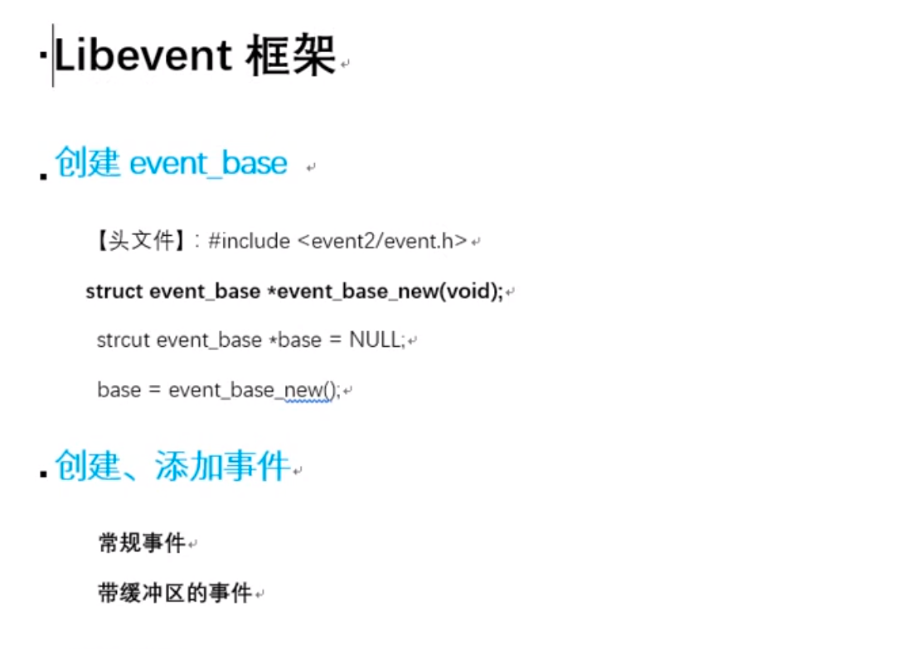
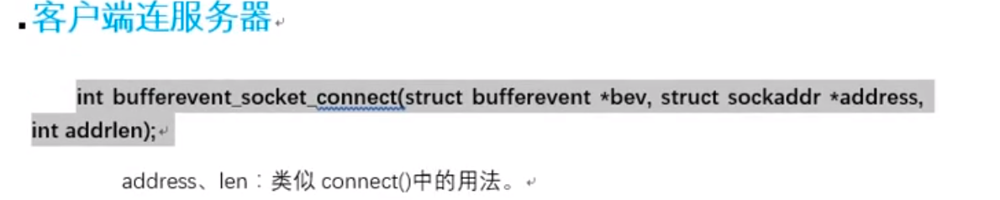
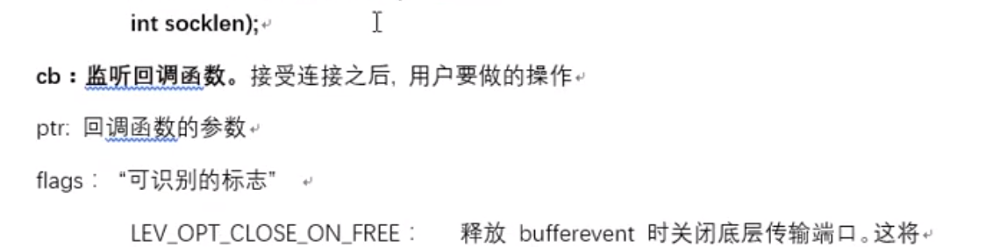

# 05 LIBEVENT

libevent库:

​		开源, 精简. 跨平台 (windows, linux, maxos, unix) 专注于网络通信

源码包安装: 参考 README, readme https://www.cnblogs.com/linjiqin/p/6943927.html 

​		sudo ./configure  -prefix /usr     检查安装环境  生产makefile

​		sudo make   生产.o 和 可执行文件

​		sudo make install   将必要的资源cp至系统指定目录

​		进入sample目录, 运行demo验证库安装使用情况.

​		编译使用库的 .c 时 需要加  -levent 选项

​		库名 libevent.so  --> /usr/local/lib 查看的到

特性: 

​		基于"事件"**异步**通信模型.   ---回调.

libevent框架:

​		创建 event_base     (乐高底座)

​				struct event_base *event_base_new(void);

​				struct event_base *base = event_base_new();

​		创建 事件event

​				常规事件  event  --->event_new();

​				bufferevent    --->bufferevent_socket_new();

​		将事件 添加到 base上

​				int event_add(struct event* ev, const struct timeval * tv)

​		循环监听事件满足

​				int event_base_dispatch(struct event_base *base);

​							event_base_dispatch(base);

​		释放 event_base

​					event_base_free(base);

创建事件:

​		struct event* ev;

​		struct event* event_new(struct event_base *base, evutil_socket_t fd, short what, event_callback_fn cb; void\* arg);

​		base: event_base_new() 返回值

​		fd : 绑定到event上的文件描述符

​		what: 对应的事件(r, w , e)

​				EV_READ        一次读事件

​				EV_WRITE     一次写事件

​				EV_PERSIST    持续触发, 结合event_base_dispathch函数使用, 生效

​		cb: 一旦事件满足监听条件, 回调的函数

​				typedef void(*event_callback_fn)(evutil_socket_t fd, short, void\*)

​								

​		arg: 回调的函数的参数

​		返回值: 成功创建的event

添加事件到event_base

​		int event_add(struct event* ev, const struct timeval * tv);

​				ev: event_new(struct event * ev) 的返回值.

​				tv: 为 NULL, 不会超时

从event_base上摘下事件     [了解]

​			int event_del(struct event * ev);

​					ev:event_new() 的返回值

销毁事件:

​		int event_free(struct event * ev);

​					ev:event_new() 的返回值

未决和非未决

​			非未决: 没有资格被处理

​			未决: 有资格被处理, 但尚未被处理

​			event_new -- > event ----> 非未决 ----->event_add --->未决  ---> dispatch() && 监听事件被触发 -->激活态  ---> 执行回调函数  ---> 处理态.  ---->非未决 event_add && EV_PERSIST  --->未决  ---> event_del  ----> 非未决  

带缓冲区的事件 bufferevent

​			#include <event2/bufferevent.h>

​			read/write 两个缓冲, 借助队列.

创建, 销毁 bufferevent:

​			struct bufferevent* ev;

​			struct bufferevent* bufferevent_socket_new(struct event_base * base, evutil_socket_t fd, enum bufferevent_options options);

​			base: event_base

​			fd:    封装到bufferevent内的fd

​			options: BEV_OPT_CLOSE_ON_FREE

​			返回: 成功创建的bufferevent 事件对象

​			void bufferevent_socket_free(struct bufferevent* ev);

给bufferevent 设置回调:

​			对比event:      event_new(fd,  callback);   					event_add() --- 挂到 event_base上

​									bufferevent_socket_new(fd)     bufferevent_setcb(callback)

​			void bufferevent_setcb(struct bufferevent* bufev, 

​														bufferevent_data_cb readcb,

​														bufferevent_data_cb writecb,

​														bufferevent_event_cb eventcb,

​														void* cbarg);

​			bufev: bufferevent_socket_new()  返回值

​			readcb: 设置bufferevent 读缓冲, 对应回调    read_cb{  bufferevent_read() 读数据, }

​			writecb: 设置bufferevent 写缓冲, 对应回调  write_cb {   }  -- 给调用者, 发送写成功通知, 可以NULL

​			eventcb 设置事件回调.  也可传NULL

​						typedef void (*bufferevent_event_cb)(struct bufferevent\* bev, short events, void *ctx);

​						void event_cb(struct bufferevent\* bev, short events, void *ctx)

​							{

​							}

​								events: BEV_EVENT_CONNECTEDi

​			cbarg :  上述回调函数使用的参数.

​			read回调函数类型:

​						typedef void (*bufferevent_data_cb)(struct bufferevent *bev, void\* ctx);

​						void read_cb(struct bufferevent* bev, void* cbarg)

​							{

​										........

​										bufferevent_read();

​							}			

​				bufferevent_read() 函数原型:

​							size_t bufferevent_read(struct bufferevent* bev, void* buf, size_t bufsize);

​				write回调函数类型:

​							int  bufferevent_write(struct bufferevent* bufev, const void* data, size_t size);

启动, 关闭 bufferevent的缓冲区

​							void bufferevent_enable(struct bufferevent * bufev, short events);     //启动

​									events: EV_READ/ EV_WRITE, EV_READ | EV_WRITE	

​									默认, write 缓冲是enable, read 缓冲是 disable					

​												bufferevent_enable(ev, EV_READ);     ---开启读缓冲

客户端: 

​				socket();  connect();

​				int bufferevent_socket_connect(struct bufferevent *bev, struct sockaddr\* address, int addrlen);

​							bev: bufferevent 事件对象(封装了fd)

​							address, len : 等同于 connect() 参2/3

创建监听服务端:

​				--------   socket();  bind();  listen();  accept();		

​				struct evconnlistener* listener;

​				struct evconnlistener* evconnlistener_new_bind(

​						struct event_base * base, 

​						evconnlistener_cb cb, 

​						void *ptr, 

​						unsigned flags,

​						int backlog,

​						const struct sockaddr* sa, 

​						int socklen);

​				base: event_base

​				cb: 回调函数, 一旦被回调, 说明在其内部应该与客户端连接完成, 数据读写操作,进行通信.

​				ptr: 回调函数的参数

​				flags:  LEV_OPT_CLOSE_ON_FREE | LEV_OPT_REUSEABLE

​				backlog: listen函数的 第二个参数 -1 表示最大值 

​				sa: 服务器自己的地址结构

​				socklen: 服务器自己的地址结构体大小

​				返回值:  成功创建的监听器.

释放监听服务器:

​			void evconnlistener_free(struct evconlistener* lev);

服务器端libevent创建TCP连接

1.创建event_base

2.创建bufferevent事件对象. bufferevent_socket_new();

3.使用bufferevent_setcb() 函数给bufferevent的read, write, event设置回调函数

4.当监听的事件满足时, read_cb会被调用, 在其内部 bufferevent_read()；读

5.创建监听服务器 evconnlistener_new_bind 创建监听服务器. 设置其回调函数, 当有客户端成功连接时, 这个回调函数会被调用.

6.封装listener_cb() 在函数内部. 完成与客户端通信

7.设置读缓冲,写缓冲的使能状态 enable, disable

8.启动循环 event_base_dispatch();

9.释放连接.

​											

