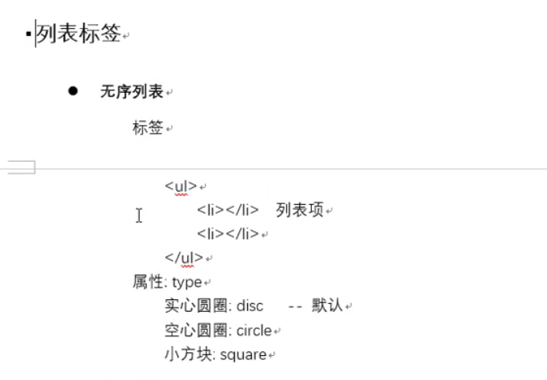
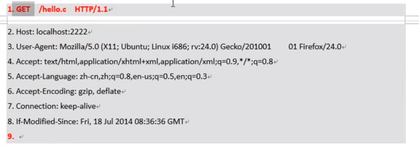

# 06 简单的webserver

请求协议:    --浏览器组织发送

​			GET /xxx Http/1.1

应答协议:

Http1.1 200 OK

1.getline() 获取http协议的第一行

2.从首行中拆分 GET, 文件名, 协议版本. 获取用户请求的文件名.

3.判断文件是否存在. stat()

4.判断是文件还是目录.

5.是文件--open -- read --写回给浏览器

6.先写http应答协议头: http/1.1 200 ok

​										Content-Type: text/plain: charset=iso8859-1

7.写文件数据.

scandir(待操作的目录, &子目录项列表数组, 过滤器(通常NULL), alphasort);

unicode 码 , --- >服务器发送的时候回传编码, 浏览器接受回传的编码, ---->解码.

 

