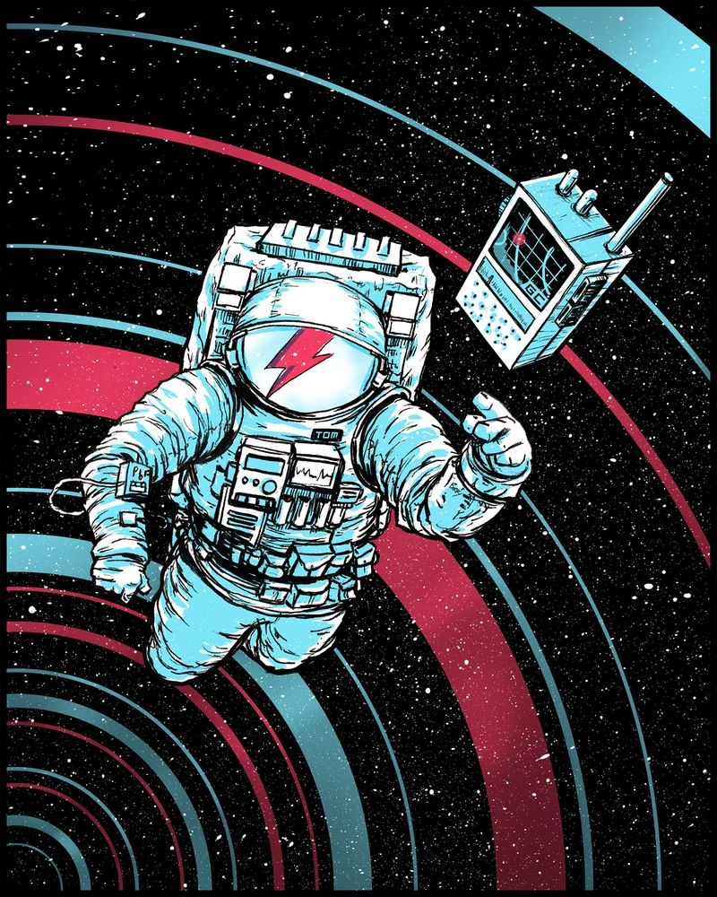

# Interview_Summary
记录 

**1.面经题目及回答** 

**2.看过的书的总结** 

**3.一些使用技巧??**

目前总结方向:

1.CPP\STL\OOP

2.Linux\APUE\UNP  结合计算机网络\操作系统

3.面试题目及答案(附上参考文献)

4.SQL我还没学啊啊啊啊啊(什么redis\什么事物)

5.Typora\Markdown

Marjor Kwong 

Just For Freedom 2021 1.3

